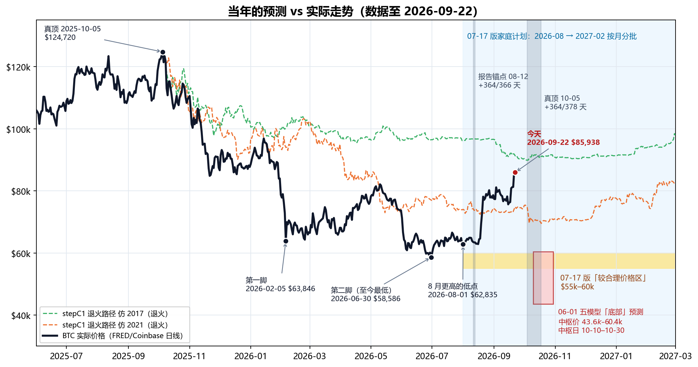
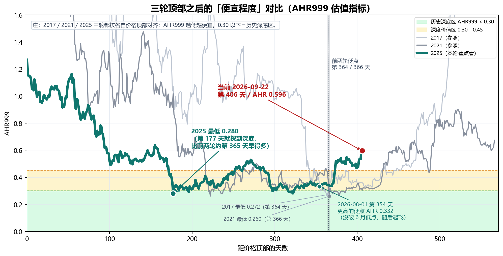
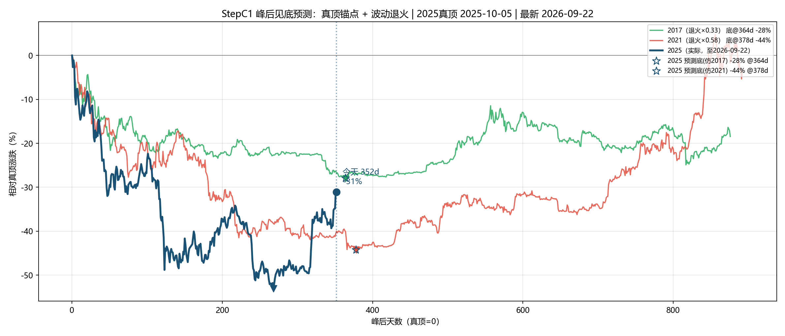
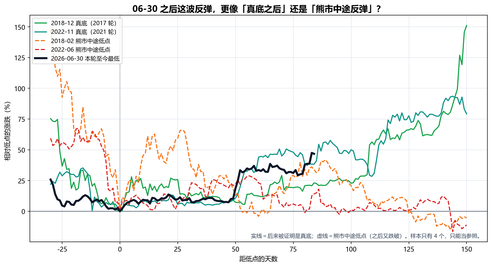
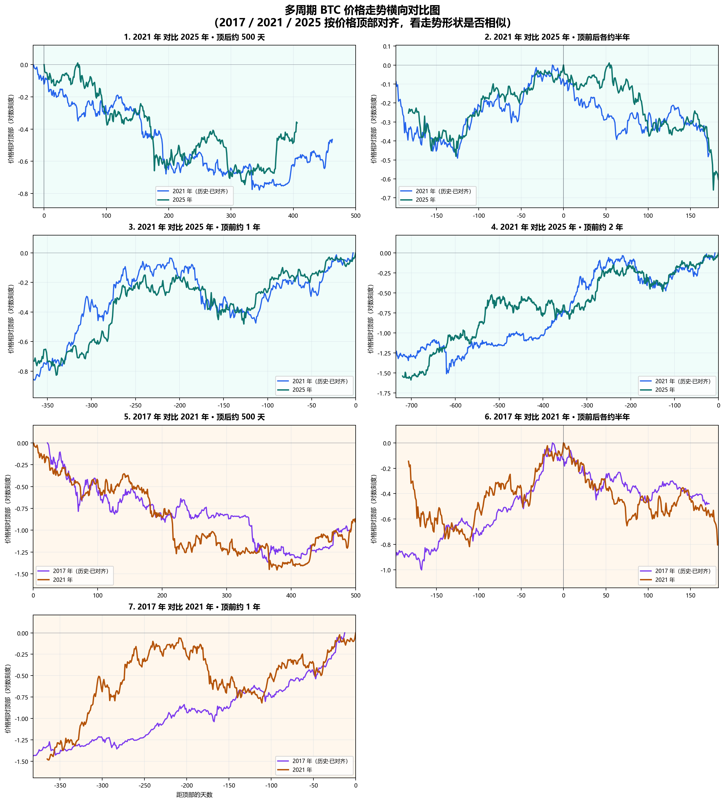
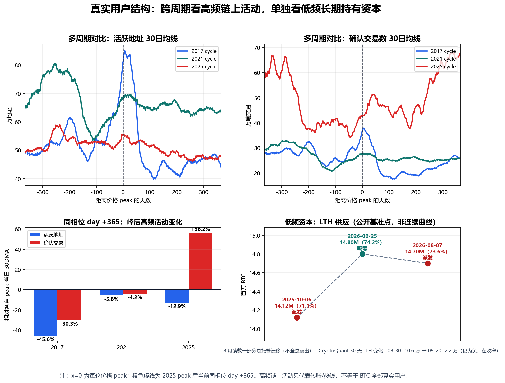

# 比特币市场周期分析与配置建议（2026-09-22 更新版）

生成日期：2026-09-22 ｜ 2026 年 9 月 · 家庭内部讨论稿 ｜ 上一版：2026-07-17（原文件原样保留，未改动）  
目的：BTC 走出了我们上一版的预期，用最新价格把当年的计算**重新抓取、重新计算、重新出图**，逐条对照「当时怎么说 → 后来怎么走」，再决定家庭计划要不要调整。

> **本次更新一句话**：6 月 30 日 **$58,586** 至今仍是本轮最低点；8 月中两次在 **$62.8k** 附近踩稳后，8 月 17 日开始上涨，今天 **$85,938**（比 6 月低点 **+47%**，比 2025-10 真顶仍 **-31%**）。AHR999 从 0.34 升到 **0.60**，已经离开 0.45 以下的「深度价值区」。**我们对了三件事：顶部时间、底部价格、AHR 深底读数。我们错了一件大事：以为 8–10 月还会再跌回 55–60k 给我们慢慢买——到今天为止没有发生。**家庭计划的纪律不变（总额定死、按月分批、不加码、不借钱），但**价格预期要改**：剩下几笔大概率比原来想的贵。

## 1. 当年的预测 vs 实际 —— 对照表

下图把我们 6 月、7 月做过的所有主要预测，和后来的真实走势画在一起：黄色带是 7 月版家庭计划说的「较合理价格区 $55k–60k」，红框是 6 月五个模型给的「底部」，两条虚线是按历史走势「退火」（按本轮较小的波动幅度压扁历史跌幅，见 §2.3）后的路径，两条灰色竖带是两种「顶后 365 天」时间窗。

| 当年的计算 | 当时的结论 | 实际（截至 2026-09-22） | 对/错 |
|---|---|---|---|
| 减半→顶 536 天（2017/2021 两轮） | 本轮顶约 2025-10-08 | 实际顶 2025-10-05/06 | ✅ 对（差 2–3 天） |
| 06-01 五模型：底部**价格** | 中枢 $43,611–$60,385；共识中位 $57,626 | 至今最低 **$58,586**（2026-06-30） | ✅ 对（落在区间内、接近中位） |
| 06-01 五模型：底部**时间** | 中枢 2026-10-10 ~ 10-30 | 低点出现在 06-30，**早了 3–4 个月** | ❌ 时间错（除非 10 月再跌破） |
| AHR999 深底 0.26–0.28 | 本轮也会探到这一带 | 2026-02-05 **0.280**；2026-06-30 **0.281** | ✅ 对 |
| 报告锚点 08-12 + 364/366 天 | 2026-08-11 ~ 08-13 附近是时间底 | 第 365 天 $63,402；08-01 $62,835 与 08-16 $62,859 两次踩在同一位置，**08-17 起飞** | ⚠️ 时间点对上了，但它是「更高的低点」，不是新低 |
| 真顶 10-05 + 364/378 天（stepC1） | 2026-10-04 ~ 10-18 附近是时间底 | 还没到；要跌破 6 月低点需从今天再跌 **32%** | 🟡 待验证 |
| stepC1 退火价格底 -28% ~ -44% | $69.5k–$89.9k | 6 月跌到 **-53%**（比模型深）；今天 **-31%**，又回到模型区间里 | ⚠️ 半对 |
| stepD12 价格区间 | $29k–$57k，中枢 $39k | 至今最低 $58,586 | ❌ 太悲观 |
| 07-17 家庭计划「55–60k 较合理价格区」 | 2026-08 → 2027-02 窗口里大概率能在这一带买 | 窗口内最低 **$62,835**（08-01，只比 60k 高 5%）；8 月均价 $69,481，9 月至今均价 $79,168 | ❌ 错：55–60k 在窗口开始前（6 月底）就到过，窗口里没再回来 |
| 「W 底」（2 月第一脚 → 6 月第二脚） | 第二脚后反弹 | 06-30 后 **+47%** | ✅ 对 |
| 「真正时间底大概率在 8–10 月」 | 8–10 月还会再跌回来 | 8 月没破 6 月低点，反而上涨 | ❌ 至今是错的（10 月还没过完） |
| 长期持有者「刚从派发切到吸筹」 | 支持买入的证据之一 | 8 月上涨后又转回小幅派发（获利了结，且在放慢，见 §5.2） | ⚠️ 变了，黄灯 |

**怎么读这张表**：我们的**价格**判断基本是对的（底部价格、AHR 深底、W 底），错在**时间**——我们以为底在 10 月前后，实际上价格在 6 月底就见了低点，8 月中开始上涨。家庭计划恰好是从 8 月开始按月买的，所以**最便宜的那段（6 月底 $58k–62k）落在了计划开始之前**。

> **诚实提示**：这张表里的「对」也只是一轮的结果。可对比的成熟周期只有 2017、2021 两轮，任何一条「对了」都不能当成规律被证实，「错了」也不能说明模型全废——它说明的是：**时间预测比价格预测更不可靠**。这正是当初坚持「按月分批、不赌某一天」的原因。

## 2. 峰后 365 天对照 + 波动退火（重新计算）

### 2.1 两个锚点，两个答案

本轮「顶」有两种算法，结论不同，必须分开看：

| 锚点 | 含义 | 今天是顶后第几天 | 前两轮「顶→底」天数 | 对应的时间底 | 现状 |
|---|---|---:|---|---|---|
| **2025-08-12**（家长报告统一锚点） | 按顶部结构对齐的锚点 | **第 406 天** | 364 / 366 | 2026-08-11 ~ 08-13 | 已过；那几天正好是起飞前最后一个低点 |
| **2025-10-05**（stepC1 真顶，$124,720） | 价格最高点 | **第 352 天** | 364 / 378 | 2026-10-04 ~ 10-18 | 还有 12–26 天 |

- **按 08-12 锚点**：前两轮 AHR999 低点都在顶后第 364/366 天。本轮第 365 天（2026-08-12）价格 $63,402，前后两次在 $62.8k 踩稳，4 天后开始上涨。**时间点几乎对上，但方向和历史不同**：前两轮第 365 天是「最深的底」，本轮第 365 天是「比 6 月更高的低点」——最深的底已经在第 322 天（6 月 30 日）提前出现了。
- **按 10-05 真顶锚点**：时间底窗口是 10 月 4 日–18 日，还没到。价格要在这个窗口里跌破 6 月低点，需要从今天再跌 32%。

### 2.2 AHR999：三轮顶后的「便宜程度」（按 08-12 锚点对齐，重新计算）

| 周期 | 价格顶部 | 日期 | 距顶部天数 | AHR999 | 含义 |
|---|---:|---:|---:|---:|---|
| 2017 顶后低点 | 2017-12-16 | 2018-12-15 | 第 364 天 | 0.272 | 历史深底区 |
| 2021 顶后低点 | 2021-11-08 | 2022-11-09 | 第 366 天 | 0.260 | 历史深底区 |
| 2025 第一脚 | 2025-08-12 | 2026-02-05 | 第 177 天 | 0.280 | 本轮 AHR 真最低 |
| 2025 第二脚 | 2025-08-12 | 2026-06-30 | 第 322 天 | 0.281 | 本轮价格最低（$58,586） |
| 2025 8 月低点 | 2025-08-12 | 2026-08-01 / 08-16 | 第 354 / 369 天 | 0.332 / 0.336 | 更高的低点，随后上涨 |
| **当前** | 2025-08-12 | **2026-09-22** | **第 406 天** | **0.596** | 已离开深度价值区，进入 0.45–1.2「定投区」 |

**把 AHR999 换算成今天的价格**（AHR999 大致和价格的平方成正比，200 日均线短期变化不大）：

| AHR999 | 含义 | 今天大约对应的 BTC 价格 |
|---:|---|---:|
| 0.30 | 历史深底区上沿 | 约 **$61,000** |
| 0.45 | 深度价值区上沿 | 约 **$74,700** |
| 0.596 | **今天** | **$85,938** |
| 1.20 | 定投区上沿 / 偏热区起点 | 约 **$122,000** |

意思是：价格回到 $75k 以下，AHR 才会重新回到「深度价值区」；回到 $61k 以下才是「历史深底」。**今天的价格已经不算「深度便宜」，只是「不贵」。**（注：这些换算会随 200 日均线缓慢漂移，过几个月要重算。）

### 2.3 stepC1：真顶锚点 + 波动退火（07-17 版 vs 09-22 版）

「退火」的意思：本轮波动比前两轮小很多（人工波动等级 2017=9、2021=3、2025=1），所以把 2017、2021 的历史跌幅按系数压扁（2017×0.33、2021×0.58），再和本轮比。参数与 7 月版完全相同，只换了数据。

| 项目 | 07-17 版 | **09-22 版（重算）** |
|---|---:|---:|
| 数据最新日 / 价格 | 2026-07-17 / $63,965 | **2026-09-22 / $85,938** |
| 相对真顶（10-05） | -48.7% | **-31.1%** |
| 峰后天数（真顶锚点） | 285 天 | **352 天** |
| 仿 2017 退火路径在同一天的位置 | -22.0%（实际比它深 26.7pp） | **-26.8%（实际只比它深 4.3pp）** |
| 仿 2021 退火路径在同一天的位置 | -39.6%（实际比它深 9.1pp） | **-40.0%（实际比它浅 8.9pp）** |
| 峰后走势相关系数 r（2017 / 2021） | 0.812 / 0.750 | 0.769 / 0.724 |
| 退火预测底部跌幅 | -28% ~ -44%（$69.5k–$89.9k） | 不变（参数没改） |
| 时间底（真顶 + 364/378 天） | 2026-10-04 ~ 10-18 | 不变，还没到 |

**读法**：7 月时，本轮比两条退火路径都跌得深（6 月底 -53%，比退火模型最深的 -44% 还深 9 个百分点）。9 月的反弹把价格拉回到**两条退火路径之间**：比仿 2017 那条低一点，比仿 2021 那条高很多。换句话说，**6 月那一跌是「跌过头」，现在回到了模型认为的正常区间**。这让模型在「价格」上显得更可信，但它**不能告诉我们 10 月会不会再跌一次**——两条退火路径在 10 月初都还有一次小幅下探（仿 2021 那条在 10 月中探到约 -44%，折合约 $70k）。

## 3. 这波 +47% 是熊市反弹，还是底已经过去了？

这是本次更新最关键的问题。方法很简单：把前两轮「后来被证明是真底」的低点，和「熊市中途、之后又被跌破」的低点，都对齐到第 0 天，看本轮 6 月 30 日之后的走法更像哪一种。

| 情形 | 低点日期 | 低点价格 | 低点后 150 天内最大涨幅 | 低点后第 84 天涨幅 | 之后有没有跌破这个低点 |
|---|---|---:|---:|---:|---|
| 2018-12 真底（2017 轮） | 2018-12-15 | $3,183 | +151% | +23% | 没有（之后最低 $3,195） |
| 2022-11 真底（2021 轮） | 2022-11-21 | $15,756 | +94% | +38% | 没有（之后最低 $16,194） |
| 2018-02 熊市中途低点 | 2018-02-05 | $6,905 | +66% | +34% | **有**（后来跌到 $3,183） |
| 2022-06 熊市中途低点 | 2022-06-18 | $18,989 | +29% | +14% | **有**（后来跌到 $15,756） |
| **2026-06-30 本轮至今最低** | 2026-06-30 | $58,586 | +48%（进行中） | **+47%** | 未知 |

几条事实：

1. **本轮第 84 天 +47%，比四个参照都高。**跟得最紧的是 2022-11 那次真底（从低点涨 25% 用了 53 天，本轮用了 52 天）。
2. **熊市后期（顶后 250 天以后）的反弹，前两轮都很小**：2017 轮最大 +14%，2021 轮最大 +19%。本轮这波发生在顶后第 322–406 天，幅度 +47%，**不像前两轮熊市后期的反弹**。
3. **但熊市早期出现过更猛的反弹**：2018 年 2 月到 3 月涨了 +66%，然后又跌了 72%。所以**「涨得猛」本身不能证明见底**。
4. **历史基准率**（2015 年以来所有交易日，不分牛熊）：BTC 在未来 60 天内跌 30% 以上的概率约 **11%**，120 天内约 **21%**。要跌破 6 月低点需要跌约 32%。这个概率不小，但也不是主流情形。

**结论（有保留）**：证据**偏向**「6 月 30 日就是本轮的底，或者非常接近底」。但可对比的样本只有 2 个真底、2 个假底，而且 10-05 锚点的时间底窗口（10 月 4–18 日）还没过去。**我们不据此加码，也不据此停手**——正好说明按月分批是对的：不需要知道答案，也能执行。

## 4. 多周期价格走势横向对比（重新出图）

与 7 月版相比，新数据主要改变的是第 1 格（2021 对比 2025·顶后约 500 天）：

| 看什么 | 7 月版的读法 | 9 月版（新数据） |
|---|---|---|
| 顶后跌幅形状 | 本轮和 2021 轮高度重合 | 前 350 天依然高度重合 |
| 起飞时间 | 未发生 | **本轮在顶后第 374 天（08-12 锚，2026-08-21）从低点涨超 25%；2021 轮是第 431 天（2023-01-13）**——本轮比 2021 模板**早约 2 个月** |
| 涨跌幅度 | 本轮幅度约为上一轮的六成 | 依然成立：本轮最深 -53%，2021 轮 -77%，2017 轮 -84%——**每一轮都更浅** |

减半→顶的时间规律（536 天，误差 2–3 天）仍然是整套研究里最硬的一条；但**顶→底的时间，本轮明显比前两轮短**。一个合理的解释是：ETF、公司财库这类低频资金让跌幅变浅、节奏变快。这只是解释，不是结论。

## 5. 这波为什么涨、谁在买、谁在卖（外部报道，2026-08 ~ 09）

### 5.1 上涨的直接原因（报道的事实，不是我们的判断）

| 日期 | 事件 | 来源 |
|---|---|---|
| 08-19 | 美国财政部把长期国债回购上限从每次 $20 亿提高到至少 $40 亿（09-09 起），长期利率下行 | CoinDesk 08-24 |
| 08-19 ~ 20 | 约 $30 亿爆仓，其中空头 $27.4 亿，为 2021 年有数据以来最多；Glassnode 称是 2019 年以来最大的空头爆仓日；同期 ETF 净流入 $22.3 亿 | CoinDesk 08-20；Glassnode 08-26 |
| 08-18 ~ 20 | SEC 提出加密发行规则；总统催促国会通过 Clarity Act | Yahoo Finance 08-19 / 08-21 |
| 09-15 | **逆风**：参议院 Clarity Act 程序性投票 49–50 未通过 | CNBC 09-15 |
| 09-16 | **逆风**：美联储**加息** 25bp 至 3.75–4.00%；BTC 一度跌破 $74.9k 后收回 | 美联储声明；CoinDesk 09-18 |
| 09-21 | 约 $7.5 亿空头爆仓；ETF 单日净流入约 $10 亿（2025-10-06 以来最大）；BTC 站上 $86k | CoinDesk 09-21；The Block 09-22 |

**要点**：8 月那一下主要是**空头被迫平仓 + ETF 资金回流**，CoinDesk 当时的评论是「被迫回补，不是持续的新需求」（观点）。9 月在美联储加息、法案受挫两个逆风下仍然上涨，靠的主要是 ETF 流入。**公司财库这次不是主力**（Glassnode：三个月只买了约 5,900 枚）。

### 5.2 谁在买、谁在卖

| 口径 | 7 月版（6 月数据） | **9 月版** | 含义 |
|---|---:|---:|---|
| 美国现货 BTC ETF 持币 | 约 1,248,218 BTC（06-22，SoSoValue） | 约 **1,263,265 BTC**（09-21，Bitbo；统计口径不同，不能直接相减） | ETF 从赎回转为流入 |
| ETF 净流入 | 5–6 月最长赎回潮约 -$43 亿 | **8 月 +$35.2 亿**（2026 年最好的一个月）；**9 月至 21 日约 +$13 亿** | 本轮上涨的主要买盘 |
| ETF 平均成本 | — | 约 $82k（CoinDesk）/ 约 $86k（Glassnode） | **今天价格就在 ETF 平均成本附近** |
| 公司 + 政府财库 | 约 1,899,138 BTC | 约 **1,914,382 BTC**（CoinGecko，156 家公司 + 37 国政府） | 小幅增加，不是这波主力 |
| 长期持有者（LTH）供应 | 06-25 约 **1,480 万**、创新高；30 天净仓位**转正 = 吸筹** | 08-07 约 **1,470 万**（Glassnode，一周 -21 万，部分是 Coldcard 事件后的托管迁移） | **从吸筹转回小幅派发** |
| LTH 30 天变化（CryptoQuant，二手转述，口径与 Glassnode 不同） | — | 08-30 **-10.6 万** → 09-20 **-2.2 万** | 仍是负数，但卖得越来越少 |

**必须如实讲清楚的一点**：7 月版把「长期持有者 30 天净仓位转正（吸筹）」当成支持买入的证据之一，还把「长期持有者从吸筹转为持续派发」列成了暂停买入的信号（§9）。**8 月上涨之后，长期持有者确实又开始卖了**——Glassnode 的数据显示，8 月高点时已实现利润里约 88% 来自长期持有者，到 9 月上旬降到 47%。

我们的解读：这是**涨了之后获利了结**（在更高价格卖给 ETF 等新买家），不是 6 月那种恐慌割肉；而且卖出速度在明显放慢。按 7 月版规则，这条信号亮了**黄灯**，但还没到「持续派发」的程度。§9 给出了什么情况算红灯。

### 5.3 市场情绪：已经从「恐惧」走到「贪婪」

- 恐惧与贪婪指数（alternative.me）：09-16 为 51 → 09-21 为 70 → **09-22 为 78（极度贪婪）**。
- 突破后新增约 $20 亿杠杆仓位（CoinDesk 09-21，Coinalyze 数据）；09-22 前 24 小时爆仓约 $10.6 亿（The Block）。
- 分析师观点分歧（都只是观点）：Bitwise 的 Hougan 说「加密寒冬结束了」；Fidelity 的 Kuiper 说底「可能已经在 7 月出现」，但也「可能在 11 月或更晚再创新低」；Glassnode 的检验标准是：**站稳 $86k 算确认，跌破 $62–65k 算失败**。

**对我们的意义**：6 月我们买入的理由之一是「别人恐惧」；现在市场情绪变成了「极度贪婪」、杠杆在堆积。**这不是卖出信号，但它是「不要因为涨了而加码」最直接的理由。**

## 6. BTC 的核心基本面没有变

价格从 $58k 涨到 $86k，和它从 $124k 跌到 $58k 一样，都不改变 BTC 的第一性原理：账本仍可信、2100 万上限未变、共识未破裂、自托管属性仍在、安全预算没有失效。**涨了不代表协议更好，跌了也不代表协议坏了。**真正会破坏 BTC 的，仍然是：上限被修改、全节点验证严重中心化、矿工被可控实体集中、长期手续费撑不住安全预算，或者市场不再认为它是最可信的数字稀缺资产。

## 7. 为什么仍然只能小额

7 月版的理由一条都没有变：BTC 没有股息、没有经营利润，价格来自共识和稀缺性重估；高波动，判断对了也可能熬很久；有集中化、托管、监管、ETF 赎回、财库踩踏风险。

这次还要多加一条：**涨了之后最容易犯的错，是「后悔没多买」然后临时加码。**本轮从顶部跌了 53%，也从底部涨了 47%——同样的波动反过来一次，就是下一次深坑。仓位上限必须继续提前定死。

| 纪律 | 说明 |
|---|---|
| 不用养老钱 | 父母生活安全永远优先 |
| 不用应急金 | 医疗、家庭现金流、房屋支出优先 |
| 不借钱 | 杠杆会把长期判断变成短期爆仓 |
| 不一次买完 | 10 月的时间窗口还没过 |
| **不因为涨了而加码** | **「错过了便宜价」不是加钱的理由** |

## 8. 家庭执行方案（更新版）

**总额不变，节奏不变，只改价格预期。**

| 时间 | 动作 | 价格口径（9 月更新） |
|---|---|---|
| 2026-08 | 第一笔（已到期） | 8 月均价约 $69.5k |
| 2026-09 | 第二笔（已到期） | 9 月至今均价约 $79.2k |
| 2026-10 | 第三笔 | **10 月 4–18 日是真顶锚点的时间窗**；若价格回落，照常买这一笔，不额外加 |
| 2026-11 | 第四笔 | 同时复查长期持有者 30 天变化（§5.2、§9 的黄灯是否转红） |
| 2026-12 | 第五笔 | 不因为短期涨跌改变总额度 |
| 2027-01 | 第六笔 | 继续保持小额、无杠杆 |
| 2027-02 | 最后一笔，结束本轮计划 | 买完后停止追加计划外仓位 |

**价格口径的改动：**

- **旧口径作废**：「55–60k 是本轮窗口内较合理的价格期望区间」——这句话在窗口开始前就应验过了（6 月底），窗口里没再回来。**不要再等 55–60k 才买。**
- **新参考**（只作参考，不是触发器）：
  - 价格 < 约 $75k（AHR < 0.45，深度价值区）：买得很舒服，照常买，**不加码**。
  - 价格约 $75k–$122k（AHR 0.45–1.2，定投区）：照常按月买。**今天在这里。**
  - 价格 > 约 $122k（AHR > 1.2，偏热区）：**剩下的几笔暂停**，等 AHR 回到 1.2 以下再继续；到 2027-02 还没回来就不买了，总额只会少、不会多。
- 这三个价格会随 200 日均线漂移，**以当月重算的 AHR999 为准**，不以价格为准。

一句话：**剩下几笔大概率比原来想的贵。这是按时间分批的代价，也是它存在的原因**——我们没有猜中底部的时间，但也没有因为猜错而全部错过。

## 9. 什么情况说明我们错了（更新）

| 信号 | 说明什么 | 动作 |
|---|---|---|
| 10 月（尤其 10-04 ~ 10-18）跌破 **$58,586** | 6 月不是底；10-05 真顶锚点的时间底仍然有效 | 继续按月买，**不加码**；重新计算底部 |
| AHR999 > 1.2（今天约 $122k） | 进入偏热区 | 暂停剩余几笔 |
| 长期持有者**在下跌中**持续派发：30 天变化再次扩大到 -10 万 BTC 以上，且价格同时在跌 | 强手在下跌中离场 | 暂停买入 |
| 现状（09-20）：30 天变化 -2.2 万且在收窄，是上涨中的获利了结 | 🟡 黄灯，不是红灯 | 照常，每月复查一次 |
| 2100 万上限或核心共识出现实质破坏 | 第一性原理被破坏 | 立即重新评估 |
| 自托管、出入金、转账自由被系统性压制 | 核心属性受损 | 暂停买入 |
| 家庭现金流或应急金需要钱 | 生活优先 | 停止买入 |
| 买入后心态变成想梭哈、借钱、追涨 | 纪律失守 | 停止买入 |

## 10. 给父母的话

7 月我们说：可能要到 10 月前后才见底，价格大概在 55–60k。现在看，**价格说对了，时间说错了**——底在 6 月底就出现了，比我们以为的早，8 月中开始上涨。

这恰恰证明了当初的做法是对的：我们没有押某一天、某一个价格，而是提前定好小额总数、按月分批。猜错了时间，损失的只是「买得没有想象中便宜」，而不是「全部错过」或「一次买在高点」。

我们希望得到的支持和 7 月一样：不是相信 BTC 一定涨，而是支持一个**有边界、小额、按月分批、不加码**的长期配置实验。这笔钱可以亏、可以等很多年，但不能让父母承担心理和现金流压力。

## 11. 数据与来源

内部数据与脚本（本版全部新生成，旧版文件均未改动）：

- `data/btc_merged_daily.csv`：BTC 日线合并数据，已更新至 2026-09-22（FRED CBBTCUSD + Yahoo 当日补点）。与 7 月版相比只修订了 1 行（2026-07-17 当日收盘 $63,965 → $63,900）。
- `analysis_runs/2026-09-22_parent_btc_allocation_report/`：本版报告目录。
  - `make_forecast_vs_actual.py` → `png/forecast_vs_actual.png`、`png/bottom_aligned_rebound.png`、`forecast_scorecard.csv`、`rebound_comparison.csv`（§1、§3 的数字来源）。
  - `make_ahr999_cycle_overlay.py` → `png/ahr999_cycle_overlay_peak_aligned.png`、`ahr999_recalc_to_2026-09-22.csv`、`ahr999_cycle_overlay_summary.csv`（§2.2）。
  - `make_peak_structure_charts.py` → `png/peak_structure_all_windows_grid.png`（§4）。
  - `make_real_user_charts.py` → `png/real_user_structure_change.png`（§5.2）；LTH 基准点来自本目录 `lth_metrics_2026-09-22.csv`（在 `data/lth_metrics.csv` 基础上加了 08-07 一行，共享数据文件未改）。
- `visualization/2026-09-22/`：整条分析流程（step01–05、stepA1–A3、stepB4、stepC1）按新数据重跑的全部输出；`stepC1_bottom_forecast.txt` 是 §2.3 的数字来源。
- `output/core_points_2026-09-22/`：stepD1–D14 核心点分析按新数据重跑的输出（原 `output/core_points/` 保留为 7 月版不动）。
- `analysis_runs/2026-06-01_parent_report/tables/model_average_inputs.csv`：6 月五模型底部预测原文（§1 对照表的「当时的结论」）。
- `visualization/2026-07-17/stepC1_bottom_forecast.txt`：7 月版退火预测原文。

外部来源：

- FRED / Coinbase Bitcoin CBBTCUSD：https://fred.stlouisfed.org/series/CBBTCUSD
- blockchain.com Charts API（活跃地址、确认交易数）：https://api.blockchain.info/charts/
- CoinDesk 2026-08-20：空头爆仓创纪录 $27 亿 —— https://www.coindesk.com/markets/2026/08/20/bearish-crypto-bets-lose-record-usd2-7-billion-as-bitcoin-surges-toward-usd70-000
- CoinDesk 2026-08-24：财政部 $40 亿国债回购与 BTC 上涨 —— https://www.coindesk.com/markets/2026/08/24/bessent-s-usd4-billion-bond-buyback-wanted-lower-yields-it-got-a-bitcoin-surge-instead
- CoinDesk 2026-08-07：Coldcard 事件后约 21 万 BTC 离开老钱包 —— https://www.coindesk.com/markets/2026/08/07/coldcard-fallout-shows-up-onchain-as-210-000-bitcoin-leaves-old-wallets
- Glassnode The Week On-chain（第 34 / 36 / 37 周，2026-08-26 / 09-09 / 09-16）—— https://research.glassnode.com/
- CNBC 2026-09-15：参议院 Clarity Act 程序性投票未通过 —— https://www.cnbc.com/2026/09/15/senate-cloture-vote-on-clarity-act-fails-dealing-regulatory-setback-to-crypto-industry.html
- 美联储 2026-09-16 议息声明 —— https://www.federalreserve.gov/newsevents/pressreleases/monetary20260916a.htm
- CoinDesk 2026-09-18 / 09-21：加息与法案受挫后的走势；新增杠杆约 $20 亿 —— https://www.coindesk.com/markets/2026/09/21/bitcoin-could-test-usd90-000-after-shorts-get-squeezed-but-traders-warn-leverage-is-building
- The Block 2026-09-22：ETF 单日净流入约 $10 亿 —— https://www.theblock.co/news/markets/2026-09-22-spot-bitcoin-etfs-1-billion-daily-inflow-416005
- Cointelegraph 2026-09-02（SoSoValue 数据）：8 月 ETF 净流入 $35.2 亿 —— https://cointelegraph.com/markets/bitcoin-etf-best-month-2026-btc-up-25-august
- Bitbo US ETF 持币（09-21）：https://bitbo.io/treasuries/us-etfs/ ；TFTC 9 月 ETF 流量：https://www.tftc.io/bitcoin-etf-flows/september-2026
- CoinGecko BTC 财库（2026-09-22 访问）：https://www.coingecko.com/en/treasuries/bitcoin
- KuCoin 转述 CryptoQuant：LTH 30 天变化收窄至 -21,700 BTC —— https://www.kucoin.com/news/flash/bitcoin-long-term-holder-supply-outflows-slow-to-21-700-btc-in-30-days
- Bitcoin Magazine 2026-09-03（Fidelity Kuiper 观点）—— https://bitcoinmagazine.com/news/bitcoin-bear-market-not-over-says-fidelity
- alternative.me 恐惧与贪婪指数 API：https://api.alternative.me/fng/

说明：以上外部数字由一次网络检索整理，均附日期与链接；二手转述的已注明。不同机构的 ETF 持币、LTH 口径不同，本报告不做跨口径相减。

免责声明：本报告是家庭内部研究材料，不是投资顾问建议。BTC 属于高波动、高不确定性资产，只适合小额、长期、可承受损失的资金。
