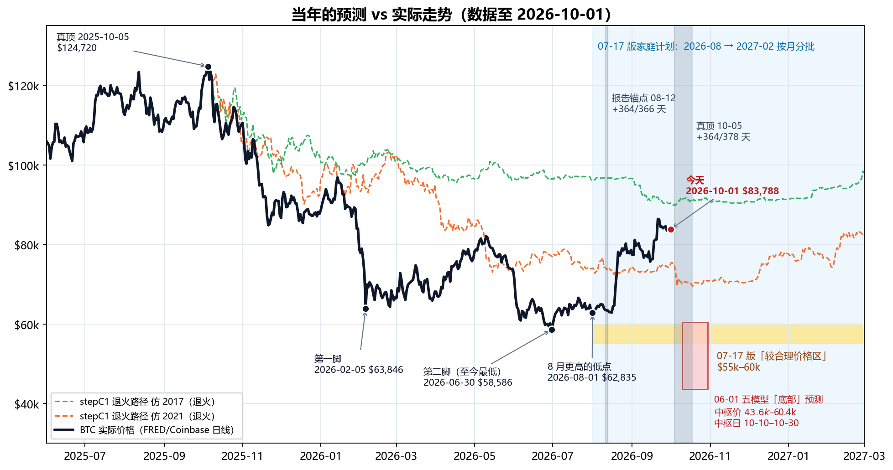
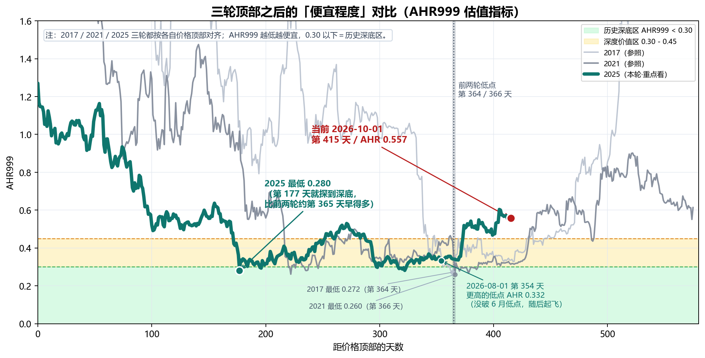
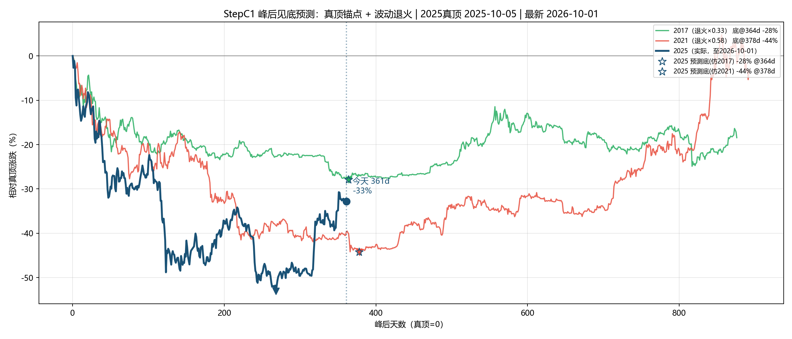
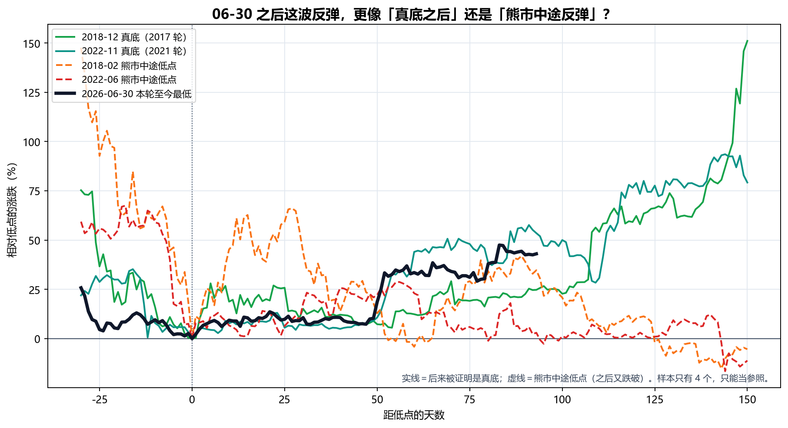
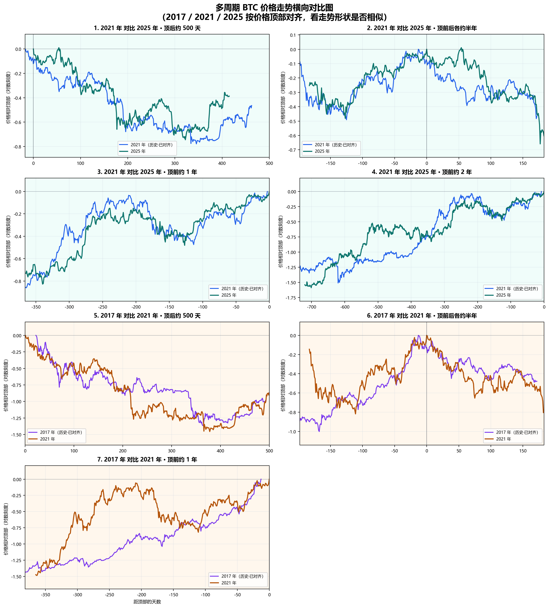
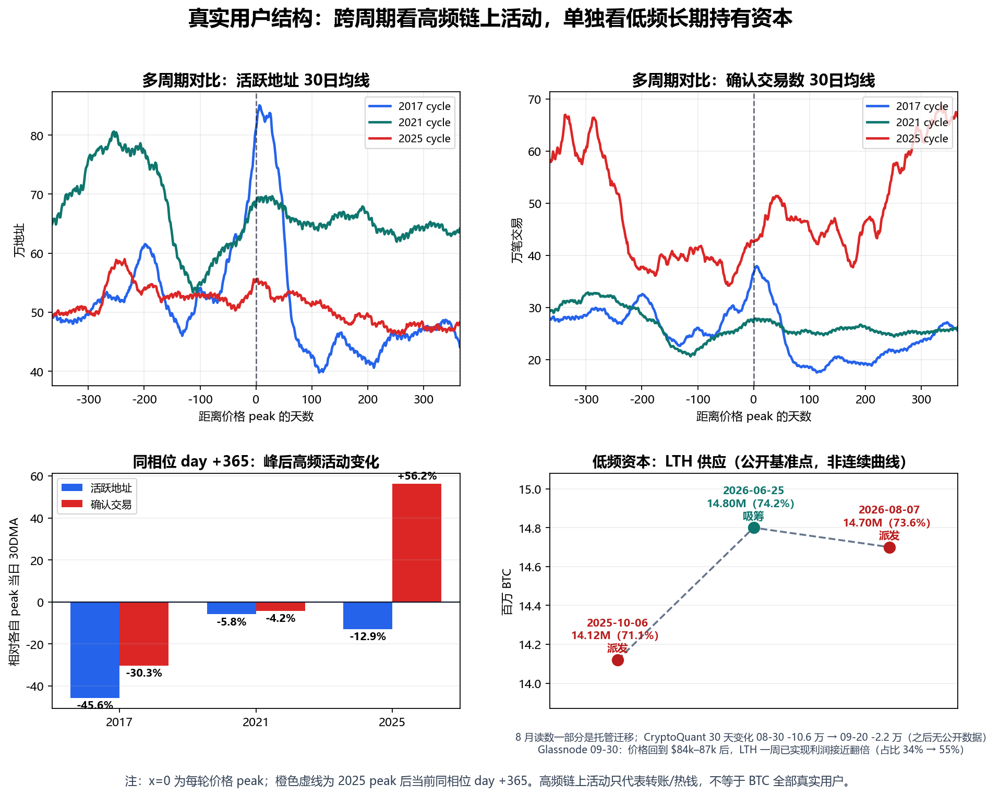

# 比特币市场周期分析与配置建议（2026-10-01 更新版）

生成日期：2026-10-01 ｜ 2026 年 10 月 · 家庭内部讨论稿 ｜ 上一版：2026-09-22（原文件原样保留，未改动）  
目的：10 月第三笔买入到期；同时，按真顶（2025-10-05）推算的「时间底窗口」（10 月 4–18 日）三天后开始——这是 6 月、7 月那批预测里**最后一个还没被验证的时间点**。用 10-01 的最新价格把全部计算**重新抓取、重新计算、重新出图**，并在窗口开始之前，先把「可能发生什么、每种情况怎么做」写下来。

> **本次更新一句话**：09-22 之后 BTC 没有继续上冲，而是在 **$83.5k–84.6k** 的窄区间横了 9 天（美债收益率升到 2007 年以来最高、油价上涨、$85k 上方卖压重、ETF 流入逐日减少，见 §6），今天 **$83,788**（比 6 月低点 **+43%**，比 2025-10 真顶 **-33%**）。6 月 30 日的 **$58,586** 仍是本轮最低点；AHR999 从 0.60 回到 **0.557**，仍在 0.45–1.2 的「定投区」。三天后进入 10 月 4–18 日时间窗：按 2015 年以来的历史基准率，17 天里**回踩到 $75k 一带大约四次里有一次，跌破 6 月低点大约只有 2%**。**家庭计划不变：10 月这一笔照常买，不加码、不提前，也不为了等窗口里的低价而拖延。**

## 0. 和 09-22 版相比，变了什么

| 项目 | 09-22 版 | **10-01 版** |
|---|---|---|
| 最新价格 | $85,938（当日盘中；FRED 事后修订为收盘 $86,250） | **$83,788**（10-01 当日盘中） |
| 09-22 之后的走势 | — | 9 天在 **$83,483–$84,554** 之间窄幅横盘；09-21 的 $86,397 仍是 6 月低点以来最高收盘 |
| 相对 2025-10-05 真顶 | -31.1% | **-32.8%** |
| 相对 06-30 低点 | +47% | **+43%** |
| 要跌破 6 月低点还需再跌 | 32% | **30%** |
| AHR999 | 0.596 | **0.557**（定投区 0.45–1.2） |
| 顶后天数（10-05 锚 / 08-12 锚） | 352 / 406 | **361 / 415** |
| 真顶时间窗 10-04 ~ 10-18 | 还有 12–26 天 | **3 天后开始，17 天后结束** |
| 9 月均价 | 截至 09-22 约 $79.2k | **全月 $80,482**（9 月收涨 6.2%） |
| 恐惧与贪婪指数 | 78（极度贪婪） | **74（贪婪）**；09-23 以来一直在 70–74 |
| 美国现货 ETF 9 月净流入 | 截至 21 日约 +$13 亿 | **全月约 +$26.5 亿**；但逐日递减，09-30 转为净流出 $1.49 亿 |
| 长期持有者 | 30 天变化 -2.2 万 BTC（09-20），「卖得越来越少」 | **获利了结又增加**：一周已实现利润接近翻倍（Glassnode 09-30）；30 天变化没有新数据 |
| 美国 10 年期国债收益率 | 4.96%（09-22） | **5.26%**（09-29，2007 年以来最高） |

数据说明：本版只有一处历史数据被修订——09-22 当日收盘，从 09-22 版用的盘中价 $85,938 修订为 FRED 正式收盘 $86,250；其余历史数据与 09-22 版相同。今天（10-01）的价格是 Yahoo 当日盘中补点，FRED 正式数据到 09-30（$83,483）。

## 1. 当年的预测 vs 实际 —— 对照表

下图把我们 6 月、7 月做过的所有主要预测，和后来的真实走势画在一起：黄色带是 7 月版家庭计划说的「较合理价格区 $55k–60k」，红框是 6 月五个模型给的「底部」，两条虚线是按历史走势「退火」（按本轮较小的波动幅度压扁历史跌幅，见 §2.3）后的路径，两条灰色竖带是两种「顶后 365 天」时间窗。今天的红点正好站在第二条灰带（10 月 4–18 日）的左边。

| 当年的计算 | 当时的结论 | 实际（截至 2026-10-01） | 对/错 |
|---|---|---|---|
| 减半→顶 536 天（2017/2021 两轮） | 本轮顶约 2025-10-08 | 实际顶 2025-10-05/06 | ✅ 对（差 2–3 天） |
| 06-01 五模型：底部**价格** | 中枢 $43,611–$60,385；共识中位 $57,626 | 至今最低 **$58,586**（2026-06-30） | ✅ 对（落在区间内、接近中位） |
| 06-01 五模型：底部**时间** | 中枢 2026-10-10 ~ 10-30 | 低点出现在 06-30，**早了 3–4 个月** | ❌ 时间错（除非 10 月再跌破） |
| AHR999 深底 0.26–0.28 | 本轮也会探到这一带 | 2026-02-05 **0.280**；2026-06-30 **0.281** | ✅ 对 |
| 报告锚点 08-12 + 364/366 天 | 2026-08-11 ~ 08-13 附近是时间底 | 第 365 天 $63,402；08-01 $62,835 与 08-16 $62,859 两次踩在同一位置，**08-17 起飞** | ⚠️ 时间点对上了，但它是「更高的低点」，不是新低 |
| 真顶 10-05 + 364/378 天（stepC1） | 2026-10-04 ~ 10-18 附近是时间底 | **3 天后开始**；要跌破 6 月低点需从今天再跌 **30%** | 🟡 待验证（本月见分晓，见 §4） |
| stepC1 退火价格底 -28% ~ -44% | $69.5k–$89.9k | 6 月跌到 **-53%**（比模型深）；今天 **-33%**，仍在模型区间里 | ⚠️ 半对 |
| stepD12 价格区间 | $29k–$57k，中枢 $39k | 至今最低 $58,586 | ❌ 太悲观 |
| 07-17 家庭计划「55–60k 较合理价格区」 | 2026-08 → 2027-02 窗口里大概率能在这一带买 | 窗口内最低 **$62,835**（08-01，只比 60k 高 5%）；8 月均价 $69,481，**9 月均价 $80,482** | ❌ 错（09-22 版已把这句话作废） |
| 「W 底」（2 月第一脚 → 6 月第二脚） | 第二脚后反弹 | 06-30 后 **+43%**（最高 +47%，09-21） | ✅ 对 |
| 「真正时间底大概率在 8–10 月」 | 8–10 月还会再跌回来 | 8、9 月都没破 6 月低点（9 月最低 **$75,656**，09-15） | ❌ 至今是错的（10 月才开始） |
| 长期持有者「刚从派发切到吸筹」 | 支持买入的证据之一 | 8 月上涨后转回派发；09-22 版说「卖得越来越少」，但 9 月下旬价格回到 $84k–87k 后，获利了结又明显增加（§6.2） | ⚠️ 变了，黄灯（未转红） |

**怎么读这张表**：结论和 09-22 版一样——我们的**价格**判断基本是对的（底部价格、AHR 深底、W 底），错在**时间**：最便宜的那段（6 月底 $58k–62k）落在家庭计划开始之前。表里**只剩一行还没有答案**：真顶 10-05 + 364/378 天的时间窗，也就是 10 月 4–18 日。§4 专门讲这个窗口。

> **诚实提示**：这张表里的「对」也只是一轮的结果。可对比的成熟周期只有 2017、2021 两轮，任何一条「对了」都不能当成规律被证实，「错了」也不能说明模型全废——它说明的是：**时间预测比价格预测更不可靠**。这正是当初坚持「按月分批、不赌某一天」的原因。

## 2. 峰后 365 天对照 + 波动退火（重新计算）

### 2.1 两个锚点，两个答案

本轮「顶」有两种算法，结论不同，必须分开看：

| 锚点 | 含义 | 今天是顶后第几天 | 前两轮「顶→底」天数 | 对应的时间底 | 现状 |
|---|---|---:|---|---|---|
| **2025-08-12**（家长报告统一锚点） | 按顶部结构对齐的锚点 | **第 415 天** | 364 / 366 | 2026-08-11 ~ 08-13 | 已过；那几天正好是 8 月起飞前最后一个低点 |
| **2025-10-05**（stepC1 真顶，$124,720） | 价格最高点 | **第 361 天** | 364 / 378 | 2026-10-04 ~ 10-18 | **3 天后开始** |

- **按 08-12 锚点**：前两轮 AHR999 低点都在顶后第 364/366 天。本轮第 365 天（2026-08-12）价格 $63,402，前后两次在 $62.8k 踩稳，随后上涨。**时间点对上了，但方向和历史不同**：前两轮第 365 天是「最深的底」，本轮第 365 天是「比 6 月更高的低点」——最深的底已经在第 322 天（6 月 30 日）提前出现了。
- **按 10-05 真顶锚点**：时间底窗口是 10 月 4–18 日，三天后开始。价格要在这个窗口里跌破 6 月低点，需要从今天再跌 30%。

### 2.2 AHR999：三轮顶后的「便宜程度」（按 08-12 锚点对齐，重新计算）

| 周期 | 价格顶部 | 日期 | 距顶部天数 | AHR999 | 含义 |
|---|---:|---:|---:|---:|---|
| 2017 顶后低点 | 2017-12-16 | 2018-12-15 | 第 364 天 | 0.272 | 历史深底区 |
| 2021 顶后低点 | 2021-11-08 | 2022-11-09 | 第 366 天 | 0.260 | 历史深底区 |
| 2025 第一脚 | 2025-08-12 | 2026-02-05 | 第 177 天 | 0.280 | 本轮 AHR 真最低 |
| 2025 第二脚 | 2025-08-12 | 2026-06-30 | 第 322 天 | 0.281 | 本轮价格最低（$58,586） |
| 2025 8 月低点 | 2025-08-12 | 2026-08-01 / 08-16 | 第 354 / 369 天 | 0.332 / 0.336 | 更高的低点，随后上涨 |
| 2025 9 月高点 | 2025-08-12 | 2026-09-21 | 第 405 天 | 0.604 | 6 月低点以来最高 |
| **当前** | 2025-08-12 | **2026-10-01** | **第 415 天** | **0.557** | 仍在 0.45–1.2「定投区」；9 月全月最低 0.467，没有回到 0.45 以下 |

**把 AHR999 换算成今天的价格**（AHR999 大致和价格的平方成正比；下面按 10-01 的 200 日均线精确反算）：

| AHR999 | 含义 | 今天大约对应的 BTC 价格 |
|---:|---|---:|
| 0.30 | 历史深底区上沿 | 约 **$61,400** |
| 0.45 | 深度价值区上沿 | 约 **$75,300** |
| 0.557 | **今天** | **$83,788** |
| 1.20 | 定投区上沿 / 偏热区起点 | 约 **$123,100** |

和 09-22 版（约 $61.0k / $74.7k / $122k）相比，三条线都上移了几百到一千美元，因为 200 日均线在缓慢上升（09-22 约 $70,325 → 10-01 约 $70,921）。意思不变：价格回到约 $75k 以下，AHR 才会重新回到「深度价值区」；回到约 $61k 以下才是「历史深底」。**今天的价格不算「深度便宜」，只是「不贵」。**

### 2.3 stepC1：真顶锚点 + 波动退火（07-17 版 / 09-22 版 / 10-01 版）

「退火」的意思：本轮波动比前两轮小很多（人工波动等级 2017=9、2021=3、2025=1），所以把 2017、2021 的历史跌幅按系数压扁（2017×0.33、2021×0.58），再和本轮比。参数与 7 月版、9 月版完全相同，只换了数据。

| 项目 | 07-17 版 | 09-22 版 | **10-01 版（重算）** |
|---|---:|---:|---:|
| 数据最新日 / 价格 | 2026-07-17 / $63,965 | 2026-09-22 / $85,938 | **2026-10-01 / $83,788** |
| 相对真顶（10-05） | -48.7% | -31.1% | **-32.8%** |
| 峰后天数（真顶锚点） | 285 天 | 352 天 | **361 天** |
| 仿 2017 退火路径在同一天的位置 | -22.0%（实际深 26.7pp） | -26.8%（实际深 4.3pp） | **-27.5%（实际深 5.3pp）** |
| 仿 2021 退火路径在同一天的位置 | -39.6%（实际深 9.1pp） | -40.0%（实际浅 8.9pp） | **-39.6%（实际浅 6.8pp）** |
| 峰后走势相关系数 r（2017 / 2021） | 0.812 / 0.750 | 0.769 / 0.724 | **0.729 / 0.704** |
| 退火预测底部跌幅 | -28% ~ -44%（$69.5k–$89.9k） | 不变 | 不变（参数没改） |
| 时间底（真顶 + 364/378 天） | 2026-10-04 ~ 10-18 | 不变 | 不变，**3 天后开始** |

**读法**：

1. 价格仍然夹在**两条退火路径之间**：比仿 2017 那条（约 $90k）低 7%，比仿 2021 那条（约 $75k）高 11%。
2. **窗口里两条路径怎么走**：仿 2017 那条在 10 月基本走平（-27% 到 -28%，约 $90k）；仿 2021 那条在 10 月继续下探，从 10-04 的 -40%（约 $74.7k）走到 10-18 的 -44%（约 **$69.5k**）。也就是说，**模型在窗口里最深的情形，是从今天回落约 17% 到 $70k 一带——仍然比 6 月低点高约 19%**。没有一条模型路径要求 10 月必须跌破 6 月低点。
3. 相关系数 r 从 7 月起一路下降（2017：0.81 → 0.73；2021：0.75 → 0.70）。原因是本轮 6 月就见低、8 月就起飞，节奏比前两轮快，**本轮和历史模板正在慢慢分开**。模型仍然有参考价值，但越往后越不能当「路线图」。

## 3. 这波 +43% 是熊市反弹，还是底已经过去了？（更新）

方法和 09-22 版相同：把前两轮「后来被证明是真底」的低点，和「熊市中途、之后又被跌破」的低点，都对齐到第 0 天，看本轮 6 月 30 日之后的走法更像哪一种。

| 情形 | 低点日期 | 低点价格 | 低点后 150 天内最大涨幅 | 低点后第 93 天涨幅 | 之后有没有跌破这个低点 |
|---|---|---:|---:|---:|---|
| 2018-12 真底（2017 轮） | 2018-12-15 | $3,183 | +151% | +25% | 没有（之后最低 $3,195） |
| 2022-11 真底（2021 轮） | 2022-11-21 | $15,756 | +94% | +54% | 没有（之后最低 $16,194） |
| 2018-02 熊市中途低点 | 2018-02-05 | $6,905 | +66% | +35% | **有**（后来跌到 $3,183） |
| 2022-06 熊市中途低点 | 2022-06-18 | $18,989 | +29% | +3% | **有**（后来跌到 $15,756） |
| **2026-06-30 本轮至今最低** | 2026-06-30 | $58,586 | +48%（进行中） | **+43%** | 未知 |

几条事实：

1. **本轮第 93 天 +43%，在四个参照里排第二**：比 2022-11 那次真底（+54%）低，比另外三个都高。09-22 时（第 84 天 +47%）本轮还排第一；这 9 天本轮横盘，而 2022-11 那条线在同一阶段继续上涨，所以被反超。跟得最紧的仍是 2022-11 真底（从低点涨 25%，那次用了 53 天，本轮用了 52 天）。
2. **熊市后期（顶后 250 天以后）的反弹，前两轮都很小**：2017 轮最大 +14%，2021 轮最大 +19%。本轮这波发生在顶后第 322–415 天，最大 +47%，**不像前两轮熊市后期的反弹**。
3. **但熊市早期出现过更猛的反弹**：2018 年 2 月到 3 月涨了 +66%，然后又跌了 72%。所以**「涨得猛」本身不能证明见底**。
4. **历史基准率**（2015 年以来所有交易日，不分牛熊）：BTC 在未来 60 天内跌 30% 以上的概率约 **11%**，120 天内约 **21%**；**在 17 天（时间窗的长度）内跌 30% 以上，只有约 2%**。

**结论（有保留）**：证据仍然**偏向**「6 月 30 日就是本轮的底，或者非常接近底」。10 月时间窗是对这个判断最直接的检验：**如果 10-18 过去、价格没有跌破 $58,586，两个锚点的时间窗就都过去了、都没出新低，「6 月是底」的把握会明显上升**。但样本只有 2 个真底、2 个假底，我们**不据此加码，也不据此停手**。

## 4. 10 月时间窗（10-04 ~ 10-18）：事先写好的预案（本版新增）

### 4.1 窗口里可能看到的几个价位

| 价位 | 大约价格 | 距今天 | 是什么 | 17 天内触及的历史基准率 | 家庭计划怎么做 |
|---|---:|---:|---|---:|---|
| 仿 2017 退火路径 | 约 $90,000 | +7% | 模型里较浅的那条路径 | 约 47% | 照常买这一笔，不加码 |
| 09-21 高点 | $86,397 | +3% | 6 月低点以来最高收盘 | 约 70% | 照常买这一笔，不加码 |
| **今天** | **$83,788** | — | AHR 0.557，定投区 | — | — |
| Glassnode「真实市场均价」 | 约 $77,200 | -8% | Glassnode 说日线收在这以下＝这一段上涨结束（§6.3） | 约 32% | 照常买这一笔，不加码 |
| AHR 0.45 | 约 $75,300 | -10% | 回到「深度价值区」上沿 | 约 25% | 照常买这一笔，不加码 |
| 仿 2021 退火路径的窗口最低 | 约 $69,500（10-18） | -17% | 模型里较深的那条路径 | 约 12% | 照常买这一笔，不加码 |
| 6 月低点 | $58,586 | -30% | 跌破＝「6 月是底」被否定 | 约 2% | 照常买这一笔，不加码；按 §10 重新计算底部 |

**怎么读**：

1. 「17 天内触及」= 从某一天起的 17 天里，任意一天的收盘价碰到过这个价位；用的是 2015 年以来所有交易日（不分牛熊）的平均。涨、跌两个方向可能先后都发生，所以几行加起来不等于 100%。**这不是预测，只是告诉我们哪种情况常见、哪种罕见。**
2. 模型在窗口里最深只指向约 $69.5k，跌破 6 月低点的基准率只有约 2%。所以如果窗口里真的出现一个「时间底」，更可能是**一个高于 6 月低点的低点**——就像 8 月 12 日前后（08-12 锚点的时间窗）那样：时间点对上，价格不创新低。这只是可能性，不是保证。
3. **这 9 天安静得少见**：9 天的收盘价最高、最低只差 1.3%，在 2015 年以来所有 9 天区间里排在最窄的 0.4%（2023 年以来最窄）。2016 年以来类似的安静期只有 5 次，之后 30 天 2 次上涨、3 次下跌，其中 2018 年 10 月那次之后一个月跌了 33%。**安静不等于安全，也不告诉我们方向**——只说明接下来出现较大波动并不意外。

### 4.2 无论窗口里发生什么，10 月这一笔都按计划买

- **不拖延**：不为了「等窗口里的低价」把 10 月这一笔拖到 10-18 以后。17 天里跌 10% 以上的概率大约四分之一，等待本身就是在赌时间——而 6 月、7 月的经验正是：我们对时间的判断最不可靠。
- **不提前**：不因为「时间窗快到了」就把 11 月以后的额度提前买进来。
- **不加码**：就算窗口里跌到 $70k 甚至更低，也只买原定的这一笔。
- **10-18 之后复盘一次**（写进下一版）：
    - 没跌破 $58,586 → 两个锚点的时间窗都过去了，都没出新低；「6 月是底」的把握上升。**仍然不加码**，剩下几笔照常。
    - 跌破 $58,586 → 6 月不是底，按 §10 重新计算底部；**仍然只按月买**。

## 5. 多周期价格走势横向对比（重新出图）

和 09-22 版相比，第 1 格（2021 对比 2025·顶后约 500 天）只多了 9 天横盘，读法不变：

| 看什么 | 10-01 版的读法 |
|---|---|
| 顶后跌幅形状 | 前 350 天和 2021 轮高度重合 |
| 起飞时间 | 本轮在顶后第 374 天（08-12 锚，2026-08-21）从低点涨超 25%；2021 轮是第 431 天（2023-01-13）——本轮比 2021 模板**早约 2 个月** |
| 涨跌幅度 | 本轮最深 -53%，2021 轮 -77%，2017 轮 -84%——**每一轮都更浅** |

减半→顶的时间规律（536 天，误差 2–3 天）仍然是整套研究里最硬的一条；但**顶→底的时间，本轮明显比前两轮短**。一个合理的解释是：ETF、公司财库这类低频资金让跌幅变浅、节奏变快。这只是解释，不是结论。

## 6. 09-22 以来：发生了什么、谁在买、谁在卖（外部报道，2026-09-22 ~ 10-01）

### 6.1 这 9 天的主要事件（报道的事实，不是我们的判断）

| 日期 | 事件 | 来源 |
|---|---|---|
| 09-22 | 全市场单日获利了结约 2.57 万枚 BTC，为 2026 年最多（报道没有区分长期、短期持有者） | CryptoQuant（经 The Block 09-29） |
| 09-23 | BTC 盘中摸到约 $87.3k 后回落，盘中跌破 $84k；全天爆仓约 $5.8 亿，其中多头约 $4.4 亿；同日美股下跌（标普 -0.75%、纳指 -1.13%） | Cryptonomist 09-24；Bitfinex 09-28 |
| 09-22 ~ 09-29 | 美国 10 年期国债收益率从 4.96% 升到 **5.26%**（2007 年以来最高），10 年期实际利率 2.63% → 2.91%；美元同时走强 | FRED（DGS10、DFII10、DTWEXBGS） |
| 09-23 ~ 09-29 | 美联储官员（Barr、Williams）表示年内可能还要再加息一次，但「不急」 | Admiral Markets、FXStreet（转述） |
| 09-24 | Bitget 交易所被盗约 $3.5 亿；链上没有出现大量 BTC 转入交易所抛售 | Axel Adler Jr 09-25 |
| 09-26 ~ 09-28 | 美国拒绝伊朗重开霍尔木兹海峡的提议，布伦特原油期货涨 3% 以上至约 $107；09-28 开盘 BTC 从 $84.5k 跌到 $82.8k | Al Jazeera 09-28；QCP 09-28 |
| 09-28 | Strategy（原 MicroStrategy）公告：09-21 ~ 27 买入 1,665 BTC，均价 $85,681，总持仓 847,666 BTC | Strategy 8-K（公司公告原文） |
| 09-30 | 8 月 PCE 通胀低于预期（核心同比 3.0%），10 月加息概率从一半左右降到约 35%；BTC 冲到 $85.6k 后又回到 $85k 下方 | Reuters（经 Star-Advertiser）；FXStreet 10-01 |
| 09-30 | 美国现货 BTC ETF 净流出 $1.49 亿，10 个交易日来第一次流出 | Farside（经 Blockchain.news） |
| 监管 | Clarity Act 09-15 程序性投票失败后，参议院至今没有安排新的投票；SEC、CFTC 9 月下旬各自发布加密资产问答；SEC 委员 Peirce 10-02 离任 | Coin Republic 09-27；Elliptic |

**要点**：09-22 之后的回落，报道里提得最多的是**宏观逆风**——长期利率升到 19 年来最高、油价因霍尔木兹海峡问题上涨、美元走强、美联储说年内可能还要加息。另一方面，**$85k 上方有明显的卖压**：Glassnode 说 Binance 现货盘口 $85k–85.5k 的卖单墙 09-24 以后扩大到约三倍；Bitfinex 说约 65 万枚 BTC 的买入成本在 $85k–86.5k 之间（意思是：这一带买入的人一回本就容易卖）。ETF 资金仍在流入，但一天比一天少，最后一天转成流出。

### 6.2 谁在买、谁在卖

| 口径 | 09-22 版 | **10-01 版** | 含义 |
|---|---|---|---|
| 美国现货 BTC ETF 持币 | 约 1,263,265 BTC（09-21，Bitbo） | 约 **1,292,181 BTC**（09-30，Bitbo，同一来源） | 9 天又增加约 2.9 万枚 |
| ETF 净流入 | 8 月 +$35.2 亿；9 月至 21 日约 +$13 亿 | **9 月全月约 +$26.5 亿**（其中 09-22 ~ 30 约 +$13.4 亿）；09-21 ~ 25 一周 +$23.9 亿，是 2026 年最好的一周 | 仍是主要买盘，但**逐日递减**：09-21 起依次为 +$9.99 亿、+$7.15 亿、+$3.47 亿、+$1.91 亿、+$1.35 亿、+$0.31 亿、+$0.66 亿，09-30 **-$1.49 亿** |
| ETF 平均成本 | 约 $82k（CoinDesk）/ 约 $86k（Glassnode） | 约 **$81.9k**（Bitfinex 09-30） | 今天价格略高于 ETF 平均成本 |
| 公司 + 政府财库 | 约 1,914,382 BTC | 约 **1,917,676 BTC**（CoinGecko，193 家） | 小幅增加；Strategy 一周买 1,665 枚，也有公司（Sequans）清仓卖完 |
| 长期持有者（LTH）获利了结 | 30 天变化 -2.2 万 BTC（09-20，CryptoQuant，二手转述），「卖得越来越少」 | Glassnode 09-30：截至 09-29 的一周，LTH 已实现利润**接近翻倍**，占全部已实现利润的比例从 34% 升到 **55%** | **价格回到 $84k–87k 后，长期持有者卖得更多了** |
| LTH 30 天变化（CryptoQuant） | 09-20 -2.17 万 | 09-20 之后没有找到新的公开数字 | 无法确认是否还在收窄 |
| 杠杆 | 突破后新增约 $20 亿杠杆 | 期货持仓从 09-21 的 70 万枚以上降到 09-29 的 64.4 万枚，1 月以来最低（Bitfinex） | **杠杆已经被洗掉一大部分** |

**必须如实讲清楚的一点**：09-22 版说长期持有者「卖得越来越少」（30 天变化从 -10.6 万收窄到 -2.2 万），并把这条信号评为黄灯。**这 9 天的新数据方向相反**：价格回到 $84k–87k 之后，长期持有者的获利了结明显增加。

我们的解读：这仍然是**上涨中、在高位把币卖给新买家**（ETF、Strategy 这类），不是 6 月那种下跌中的恐慌性卖出；CryptoQuant 的分析师也说长期持有者的平均获利幅度（约 72%）远低于 2024 年 12 月（约 350%），属于「温和」。按 §10 的规则，红灯的标准是「在下跌中持续派发、30 天变化再次扩大到 -10 万枚以上」，目前没有达到（也没有 09-20 之后的 30 天数据）。所以：**黄灯维持，不转红；但「卖得越来越少」这句话要收回。**

### 6.3 市场情绪：从「极度贪婪」回到「贪婪」

- 恐惧与贪婪指数（alternative.me）：09-22 为 78（极度贪婪，这一波的最高）→ 之后 9 天都在 **70–74（贪婪）**，10-01 为 74。
- 杠杆：09-21 突破后堆起来的杠杆大部分已经平掉（见上表）；09-23 当天约 $4.4 亿多头被强平。
- Glassnode 的检验标准变了：09-22 时是「站稳 $86k 算确认、跌破 $62–65k 算失败」；09-23 的周报把分界线下移到 **$84k**（站稳则上看 $96.7k，跌破则回看 $77k）；09-30 的周报又说**日线收在 $77.2k 以下就算这一段上涨结束**。09-28 以来收盘都在 $84k 下方。
- 分析师观点（都只是观点）：CryptoQuant 的 Moreno 说价格站上 365 日均线「确认了新牛市」，同时提醒「有疲态、短期可能回调」，支撑看约 $80k、$71k、$67k；Glassnode 称这是「还没有广泛参与的早期上升趋势」；Bitfinex 认为非农数据（10-02）前大概率在 $82.5k–84k 震荡。
- 10 月季节性：2013–2025 年的 13 个 10 月里有 10 个上涨（CoinGlass 数据，经 Cryptopotato），但 2025 年 10 月下跌约 4%。**季节性只是统计，不是理由。**

**对我们的意义**：情绪从极度贪婪降回贪婪、杠杆被洗掉，**短期过热的程度比 09-22 低**；但宏观逆风（利率、油价、美元）和 $85k 上方的卖压都还在。这些都不改变家庭计划——它们正好说明为什么不能靠猜短期方向来决定买不买。

## 7. BTC 的核心基本面没有变

价格从 $58k 涨到 $86k、再回到 $84k，和它从 $124k 跌到 $58k 一样，都不改变 BTC 的第一性原理：账本仍可信、2100 万上限未变、共识未破裂、自托管属性仍在、安全预算没有失效。**涨了不代表协议更好，跌了也不代表协议坏了。**真正会破坏 BTC 的，仍然是：上限被修改、全节点验证严重中心化、矿工被可控实体集中、长期手续费撑不住安全预算，或者市场不再认为它是最可信的数字稀缺资产。

## 8. 为什么仍然只能小额

7 月版的理由一条都没有变：BTC 没有股息、没有经营利润，价格来自共识和稀缺性重估；高波动，判断对了也可能熬很久；有集中化、托管、监管、ETF 赎回、财库踩踏风险。

09-22 版加了一条：**涨了之后最容易犯的错，是「后悔没多买」然后临时加码。**这一版再加一条：**时间窗临近时最容易犯的错，是「等低点」**——把该买的那一笔拖着不买，想等一个更便宜的价格。本轮从顶部跌了 53%，也从底部涨了 47%；接下来半个月涨跌都可能发生，仓位上限和买入节奏必须继续提前定死。

| 纪律 | 说明 |
|---|---|
| 不用养老钱 | 父母生活安全永远优先 |
| 不用应急金 | 医疗、家庭现金流、房屋支出优先 |
| 不借钱 | 杠杆会把长期判断变成短期爆仓 |
| 不一次买完 | 按月分批到 2027-02 |
| 不因为涨了而加码 | 「错过了便宜价」不是加钱的理由 |
| **不为了等低点而拖延** | **时间窗不是择时的理由，10 月这一笔照常买** |

## 9. 家庭执行方案（10-01 更新）

**总额不变，节奏不变，价格口径按 10-01 重算。**

| 时间 | 动作 | 价格口径（10 月更新） |
|---|---|---|
| 2026-08 | 第一笔（已到期） | 8 月均价约 $69.5k |
| 2026-09 | 第二笔（已到期） | 9 月均价约 $80.5k |
| **2026-10** | **第三笔（本月）** | 今天 $83,788，AHR 0.557（定投区）。照常买这一笔；10-04 ~ 10-18 时间窗里无论涨跌，**不额外加、不拖延**（§4） |
| 2026-11 | 第四笔 | 同时复查：长期持有者 30 天变化（§6、§10 的黄灯是否转红）；10 月时间窗的结果 |
| 2026-12 | 第五笔 | 不因为短期涨跌改变总额度 |
| 2027-01 | 第六笔 | 继续保持小额、无杠杆 |
| 2027-02 | 最后一笔，结束本轮计划 | 买完后停止追加计划外仓位 |

**价格参考（10-01 重算；只作参考，不是触发器）**：

- 价格 < 约 $75.3k（AHR < 0.45，深度价值区）：买得很舒服，照常买，**不加码**。
- 价格约 $75.3k–$123.1k（AHR 0.45–1.2，定投区）：照常按月买。**今天在这里。**
- 价格 > 约 $123.1k（AHR > 1.2，偏热区）：**剩下的几笔暂停**，等 AHR 回到 1.2 以下再继续；到 2027-02 还没回来就不买了，总额只会少、不会多。
- 这三个价格会随 200 日均线漂移，**以当月重算的 AHR999 为准**，不以价格为准。

一句话：**剩下几笔大概率比原来想的贵。这是按时间分批的代价，也是它存在的原因**——我们没有猜中底部的时间，但也没有因为猜错而全部错过。

## 10. 什么情况说明我们错了（更新）

| 信号 | 说明什么 | 动作 |
|---|---|---|
| 10 月（尤其 10-04 ~ 10-18）跌破 **$58,586** | 6 月不是底；10-05 真顶锚点的时间底仍然有效 | 继续按月买，**不加码**；重新计算底部 |
| **（新增）10-18 之后仍没跌破 $58,586** | 两个锚点的时间窗都过去了、都没出新低 → 「6 月是底」的把握上升 | 照常，**不加码**；下一版把对照表里「底部时间」一行改判 |
| AHR999 > 1.2（今天约 $123k） | 进入偏热区 | 暂停剩余几笔 |
| 长期持有者**在下跌中**持续派发：30 天变化再次扩大到 -10 万 BTC 以上，且价格同时在跌 | 强手在下跌中离场 | 暂停买入 |
| 现状（09-29，Glassnode）：价格回到 $84k–87k 时获利了结增加，一周已实现利润接近翻倍；仍是**上涨中**的获利了结；30 天变化 09-20（-2.2 万）之后没有公开数据 | 🟡 黄灯，不是红灯（「卖得越来越少」已收回） | 照常；11 月复查 30 天变化 |
| 2100 万上限或核心共识出现实质破坏 | 第一性原理被破坏 | 立即重新评估 |
| 自托管、出入金、转账自由被系统性压制 | 核心属性受损 | 暂停买入 |
| 家庭现金流或应急金需要钱 | 生活优先 | 停止买入 |
| 买入后心态变成想梭哈、借钱、追涨 | 纪律失守 | 停止买入 |

## 11. 给父母的话

9 月 22 日我们说：**价格说对了，时间说错了**——底在 6 月底就出现了，比我们以为的早，8 月中开始上涨。

之后这 9 天几乎什么也没发生，价格在 $83k–85k 横着。接下来半个月，是我们 6 月份算出来的最后一个「时间底」窗口。窗口里如果跌，我们照常买这一笔；如果不跌，我们也照常买这一笔。**这就是按月分批的意义：不需要知道答案，也能把事情做对。**

我们希望得到的支持和 7 月、9 月一样：不是相信 BTC 一定涨，而是支持一个**有边界、小额、按月分批、不加码**的长期配置实验。这笔钱可以亏、可以等很多年，但不能让父母承担心理和现金流压力。

## 12. 数据与来源

内部数据与脚本（本版全部新生成，旧版文件均未改动）：

- `data/btc_merged_daily.csv`：BTC 日线合并数据，已更新至 2026-10-01（FRED CBBTCUSD 至 09-30 + Yahoo 10-01 当日补点）。与 09-22 版相比只修订了 1 行（2026-09-22 当日收盘 $85,938 → $86,250）。
- `analysis_runs/2026-10-01_parent_btc_allocation_report/`：本版报告目录（脚本从 09-22 版复制，只改了输入日期、对照表文字和 LTH 图注；`report.css` 改为长表格可以跨页）。
  - `make_forecast_vs_actual.py` → `png/forecast_vs_actual.png`、`png/bottom_aligned_rebound.png`、`forecast_scorecard.csv`、`rebound_comparison.csv`（§1、§3 的数字来源）。
  - `make_ahr999_cycle_overlay.py` → `png/ahr999_cycle_overlay_peak_aligned.png`、`ahr999_recalc_to_2026-10-01.csv`、`ahr999_cycle_overlay_summary.csv`（§2.2）。
  - `make_peak_structure_charts.py` → `png/peak_structure_all_windows_grid.png`（§5）。
  - `make_real_user_charts.py` → `png/real_user_structure_change.png`（§6）；LTH 基准点来自本目录 `lth_metrics_2026-10-01.csv`（与 09-22 版相同：这 9 天没有找到新的 LTH 供应公开数字）。
  - `report_numbers_2026-10-01.py` → `report_numbers_2026-10-01.txt`：§2.2 的 AHR 反算价格、§2.3 窗口内退火路径、§3–§4 的历史基准率和「安静期」统计。
- `visualization/2026-10-01/`：整条分析流程（step01–05、stepA1–A3、stepB4、stepC1）按新数据重跑的全部输出；`stepC1_bottom_forecast.txt` 是 §2.3 的数字来源。
- `output/core_points_2026-10-01/`：stepD1–D14 核心点分析按新数据重跑的输出（原 `output/core_points/` 保留为 7 月版不动）。stepD10/D12/D13/D14 的结论与 09-22 版完全相同（它们只依赖 2025 顶部之前的结构和固定参数）。
- `analysis_runs/2026-06-01_parent_report/tables/model_average_inputs.csv`：6 月五模型底部预测原文（§1 对照表的「当时的结论」）。
- `visualization/2026-07-17/`、`visualization/2026-09-22/` 的 `stepC1_bottom_forecast.txt`：7 月版、9 月版退火预测原文（§2.3 表格前两列）。

外部来源（09-22 版各项数字的来源见 09-22 版报告 §11）：

- FRED / Coinbase Bitcoin CBBTCUSD：https://fred.stlouisfed.org/series/CBBTCUSD
- FRED 美债收益率与美元指数：DGS10 https://fred.stlouisfed.org/series/DGS10 ；DFII10 https://fred.stlouisfed.org/series/DFII10 ；DTWEXBGS https://fred.stlouisfed.org/series/DTWEXBGS
- blockchain.com Charts API（活跃地址、确认交易数）：https://api.blockchain.info/charts/
- alternative.me 恐惧与贪婪指数 API：https://api.alternative.me/fng/
- Cryptonomist 2026-09-24：09-23 回落与美股下跌 —— https://en.cryptonomist.ch/2026/09/24/bitcoin-price-decline-spot-etf/
- Bitfinex Alpha 2026-09-28 / 09-30：09-23 爆仓、$85k–86.5k 成本带、期货持仓、ETF 平均成本 —— https://blog.bitfinex.com/bitfinex-alpha/btc-breakout-now-depends-on-spot-demand/ ；https://blog.bitfinex.com/bitfinex-alpha/bitcoin-needs-stronger-spot-demand-q4/
- Admiral Markets 2026-09-29（Barr、Williams 讲话转述）—— https://admiralmarkets.com/analytics/traders-blog/fed-williams-speech-september-29-2026 ；FXStreet 2026-09-29（Williams）—— https://www.fxstreet.com/news/feds-williams-says-no-rush-after-september-hike-202609291822
- Reuters 8 月 PCE（经 Star-Advertiser 转载，2026-09-30）—— https://www.staradvertiser.com/2026/09/30/breaking-news/u-s-inflation-rises-below-expectations-consumer-spending-robust/ ；FXStreet 2026-10-01（PCE 后走势、加息概率）—— https://www.fxstreet.com/cryptocurrencies/news/bitcoin-price-forecast-btc-struggles-below-85-000-as-etf-outflows-rising-us-treasury-yields-weigh-202610010832
- Al Jazeera 2026-09-28：霍尔木兹海峡与油价 —— https://www.aljazeera.com/economy/2026/9/28/oil-prices-surge-after-trump-rejects-irans-plan-to-reopen-strait-of-hormuz ；QCP Market Colour 2026-09-28 —— https://www.qcpgroup.com/insights/qcp-market-colour-48/
- Axel Adler Jr 2026-09-25：Bitget 事件后的链上反应 —— https://axeladlerjr.com/how-bitcoin-reacted-to-the-bitget-hack/
- Strategy 8-K（2026-09-28）—— https://assets.contentstack.io/v3/assets/bltf8d808d9b8cebd37/blteecf6b3544e56dd2/6ab9b1c199bf529f43db8f1d/form-8-k_09-28-2026.pdf ；Cryptonomist 2026-09-25：Sequans 清仓 —— https://en.cryptonomist.ch/2026/09/25/sequans-bitcoin-exit/
- The Block 2026-09-26：09-21 ~ 25 一周 ETF 流量 —— https://www.theblock.co/news/markets/2026-09-26-bitcoin-etfs-turn-positive-for-2026-with-2-4-billion-weekly-inflow-their-largest-since-october-416944
- TFTC 9 月 ETF 每日流量（逐日加总得 9 月 +$26.48 亿）—— https://www.tftc.io/bitcoin-etf-flows/september-2026 ；Blockchain.news（09-30 流出，Farside 数据）—— https://blockchain.news/flashnews/bitcoin-etf-148-7m-net-outflow-sept-30
- Bitbo US ETF 持币（09-30）：https://bitbo.io/treasuries/us-etfs/ ；CoinGecko BTC 财库（2026-10-01 访问）：https://www.coingecko.com/en/treasuries/bitcoin
- Glassnode The Week On-chain 第 38 / 39 周（2026-09-23 / 09-30）—— https://research.glassnode.com/the-week-onchain-week-38-2026/ ；https://research.glassnode.com/the-week-onchain-week-39-2026/
- The Block 2026-09-29（CryptoQuant：09-22 获利了结 2.57 万枚、Moreno 观点）—— https://www.theblock.co/news/markets/2026-09-29-cryptoquant-says-bitcoin-correction-could-near-traders-unrealized-profit-21-month-high-417206 ；crypto.news 2026-09-25（CryptoQuant Darkfost：LTH 获利幅度约 72%）—— https://crypto.news/bitcoin-holders-are-taking-profits/
- Axel Adler Jr：CryptoQuant LTH 30 天变化（截至 09-20）—— https://axeladlerjr.com/long-term-holder-supply-decline-slows-nearly-fivefold/
- Coin Republic 2026-09-27：Clarity Act 进展 —— https://thecoinrepublic.com/2026/09/27/clarity-act-setback-precedes-blockchain-association-ceo-exit ；Elliptic：SEC/CFTC 问答、Peirce 离任 —— https://www.elliptic.co/insights/crypto-regulatory-affairs-sec-and-cftc-push-cryptoasset-rulemaking-in-wake-of-failed-clarity-vote/
- Cryptopotato：10 月季节性（CoinGlass 数据）—— https://cryptopotato.com/bitcoin-enters-its-most-bullish-month-after-massive-q3-uptober-or-redtober-next/

说明：以上外部数字由一次网络检索整理，均附日期与链接；二手转述的已注明。其中 FRED 10 年期收益率、恐惧与贪婪指数、Bitbo ETF 持币、CoinGecko 财库、TFTC 9 月流量、Glassnode 第 39 周的数字，已逐项打开原页面再次核对。不同机构的 ETF 持币、LTH 口径不同，本报告不做跨口径相减。

免责声明：本报告是家庭内部研究材料，不是投资顾问建议。BTC 属于高波动、高不确定性资产，只适合小额、长期、可承受损失的资金。
