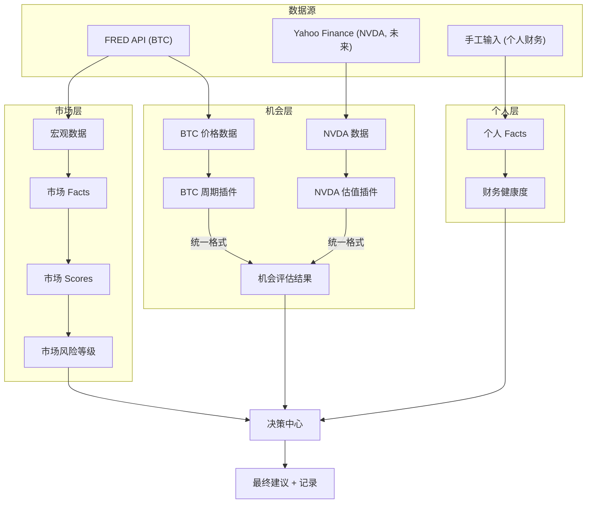

# 长期财富决策系统：总架构 V2

## 1. 一句话

**这个机会，在现在这个市场里，对现在的我，值不值得做。**

三层输入，一个决策。

---

## 2. 三层架构总览

```
┌─────────────────────────────────────────────────────────────────────────┐
│                        长期财富决策系统                                   │
│                                                                         │
│  ┌───────────────┐   ┌───────────────┐   ┌───────────────┐              │
│  │   市场层        │   │   机会层        │   │   个人层        │              │
│  │   (共用,1个)    │   │   (插拔,N个)    │   │   (共用,1个)    │              │
│  │               │   │               │   │               │              │
│  │  外部环境      │   │  标的分析       │   │  我的约束       │              │
│  │  怎么样？      │   │  好不好？       │   │  扛得住吗？     │              │
│  └───────┬───────┘   └───────┬───────┘   └───────┬───────┘              │
│          │                   │                   │                      │
│          │    ┌──────────────┤                   │                      │
│          │    │   统一输出接口 │                   │                      │
│          │    │  (所有标的     │                   │                      │
│          │    │   格式一致)    │                   │                      │
│          │    └──────────────┘                   │                      │
│          │                   │                   │                      │
│          └───────────────────┼───────────────────┘                      │
│                              ▼                                          │
│                    ┌─────────────────┐                                   │
│                    │    决策中心       │                                   │
│                    │                 │                                   │
│                    │  交叉判定        │                                   │
│                    │  → 最终建议      │                                   │
│                    │  → 决策记录      │                                   │
│                    │  → 事后复盘      │                                   │
│                    └─────────────────┘                                   │
└─────────────────────────────────────────────────────────────────────────┘
```

---

## 3. 三层职责定义

### 3.1 市场层（共用，1 个实例）

**回答：现在外部环境怎么样？**

| 维度 | 说明 |
|------|------|
| 输入 | BTC 周期数据、宏观利率、市场情绪（未来可扩展） |
| 输出 | 周期阶段、风险等级、时间窗口 |
| 特点 | **所有标的共用同一个市场判断**，不因标的不同而变 |
| 当前实现 | BTC 周期退火分析（12 个 Python 脚本） |

市场层的详细设计见：[市场层决策引擎_流程更新与IO定义V1.md](./市场层决策引擎_流程更新与IO定义V1.md)

### 3.2 机会层（插拔，N 个插件）

**回答：这个具体标的/机会，好不好？**

| 维度 | 说明 |
|------|------|
| 输入 | 标的相关数据（价格、财报、估值等，因标的而异） |
| 输出 | **统一格式的机会评估结果**（详见第 4 节） |
| 特点 | 每个标的有独立的分析逻辑，但输出格式统一 |
| 当前实现 | BTC 周期分析即为第一个机会层插件 |
| 未来扩展 | NVDA 估值模型、ETH 周期、个股分析等 |

机会层插件规范见：[01_机会层插件规范.md](./01_机会层插件规范.md)

### 3.3 个人层（共用，1 个实例）

**回答：现在的我，扛得住吗？**

| 维度 | 说明 |
|------|------|
| 输入 | 现金流、必要支出、被动收入、可承受最大回撤 |
| 输出 | 财务健康度、可投比例上限、风险承受等级 |
| 特点 | **跟标的无关，只跟我自己的状态有关** |
| 当前实现 | 未开始（阶段 4） |

---

## 4. 统一输出接口（核心设计）

**不管分析方法多不同，每个机会层插件最终都输出同一格式：**

```json
{
  "target": "BTC",
  "plugin_id": "btc_cycle_annealing",
  "plugin_version": "1.0.0",
  "generated_at": "2026-03-19T08:00:00",
  "data_freshness": "2026-03-18",

  "assessment": {
    "signal": "observe",
    "risk_level": "high",
    "confidence": 0.78,
    "time_window": {
      "start": "2025-06-01",
      "end": "2025-10-01",
      "anchor": "2025-08-15",
      "description": "预计峰值时间窗口"
    }
  },

  "context": {
    "cycle_stage": "post_peak_decline",
    "days_since_anchor": 216,
    "pct_from_anchor": -43.4,
    "pattern_match": {
      "correlation_2017": 0.91,
      "correlation_2021": 0.87,
      "rmse_2017": 12.3,
      "rmse_2021": 8.7
    }
  },

  "reasoning": [
    "当前处于峰值后衰减阶段",
    "与 2017/2021 周期退火曲线高度吻合",
    "风险等级维持高位"
  ]
}
```

**关键约束：**

- `signal` 只允许枚举值：`opportunity` / `track` / `small_position` / `observe` / `high_risk` / `insufficient_data`
- `risk_level` 只允许：`low` / `medium` / `high` / `extreme`
- `confidence` 范围 0-1
- `context` 内容因插件而异，但外层结构固定
- `reasoning` 是人类可读的判断依据列表

---

## 5. 决策中心：三层交叉判定

```
          市场层输出              机会层输出              个人层输出
              │                     │                     │
              ▼                     ▼                     ▼
         ┌─────────┐          ┌─────────┐          ┌─────────┐
         │ risk:    │          │ signal:  │          │ capacity:│
         │ high     │          │ track    │          │ medium   │
         │ stage:   │          │ risk:    │          │ max_pct: │
         │ decline  │          │ medium   │          │ 15%      │
         └────┬────┘          └────┬────┘          └────┬────┘
              │                    │                    │
              └────────────────────┼────────────────────┘
                                   │
                                   ▼
                    ┌──────────────────────────┐
                    │      交叉判定矩阵          │
                    │                          │
                    │  规则 1: 任何一层亮红灯     │
                    │         → 最终 = 观望      │
                    │                          │
                    │  规则 2: 市场高风险         │
                    │         + 机会好           │
                    │         + 个人能扛         │
                    │         → 最终 = 小仓位    │
                    │                          │
                    │  规则 3: 市场低风险         │
                    │         + 机会好           │
                    │         + 个人能扛         │
                    │         → 最终 = 长持      │
                    │                          │
                    │  规则 4: 数据不足           │
                    │         → 最终 = 不判断    │
                    └─────────────┬────────────┘
                                  │
                                  ▼
                    ┌──────────────────────────┐
                    │      最终输出              │
                    │                          │
                    │  结论: 适不适合我现在做     │
                    │  建议: 观望/跟踪/小仓位/长持│
                    │  原因: 三层各自的 reasoning │
                    │  记录: 存档供复盘          │
                    └──────────────────────────┘
```

### 5.1 交叉判定规则表（初版）

| 市场层 | 机会层 | 个人层 | → 最终建议 |
|--------|--------|--------|------------|
| 任意 | 任意 | `insufficient_data` | **不判断** |
| `extreme` | 任意 | 任意 | **观望** |
| `high` | `high_risk` | 任意 | **观望** |
| `high` | `opportunity` / `track` | `能扛` | **小仓位** |
| `high` | `opportunity` / `track` | `不能扛` | **观望** |
| `medium` | `opportunity` | `能扛` | **跟踪/小仓位** |
| `medium` | `track` | `能扛` | **跟踪** |
| `low` | `opportunity` | `能扛` | **长持** |
| `low` | `track` | `能扛` | **跟踪/小仓位** |
| `low` | `observe` | 任意 | **观望** |

**核心原则：保守优先。三层中最差的那个决定上限。**

---

## 6. 数据流总图



---

## 7. 分阶段落地路径

```
阶段 1 (当前)          阶段 2              阶段 3              阶段 4
━━━━━━━━━━         ━━━━━━━━━━         ━━━━━━━━━━         ━━━━━━━━━━
市场层 V1            决策中心             机会层扩展           个人层
BTC 周期分析         决策卡片             NVDA 插件           现金流约束
API 化              判断存档             更多标的插件         财务自由率
自动数据更新         复盘机制             统一前端展示         个人修正建议

[███████░░░░]       [░░░░░░░░░░░]       [░░░░░░░░░░░]       [░░░░░░░░░░░]
  进行中                未开始               未开始               未开始
```

### 每个阶段的"完成"标准

| 阶段 | 完成标准 |
|------|----------|
| 1 | 打开就能看到 BTC 当前周期判断，不用手动跑脚本 |
| 2 | 每次判断自动存档，能回看 "我当时为什么这么判断" |
| 3 | 加一个新标的（如 NVDA），只需写插件 + 注册，不改主流程 |
| 4 | 同一个机会，切换不同的个人财务状态，建议会不同 |

---

## 8. 文档地图：所有文档如何互相关联

```
                    产品定位与需求 V1
                    "我们在解决什么问题"
                           │
                           ▼
               ┌── 00_系统总架构 (本文档) ──┐
               │   "三层怎么组合"            │
               │                           │
        ┌──────┴──────┐          ┌─────────┴────────┐
        ▼             ▼          ▼                  ▼
  01_插件规范    02_判定流程   03_算法规格书     04_数据流
  "插件怎么写"  "怎么判定"    "公式是什么"     "数据怎么流"
        │             │          │                  │
        └──────┬──────┘          └─────────┬────────┘
               ▼                           ▼
         05_BTC插件详细设计          市场层决策引擎 V1
         "第一个插件完整规格"        "市场层内部6层设计"
               │
               ▼
         BTC小程序设计 + 实施计划
         "前端怎么做" + "后端怎么做"
```

| 文档 | 角色 | 关键交叉引用 |
|------|------|-------------|
| 本文档 (00) | 三层架构 + 统一接口 + 交叉判定 | §4 统一输出 → 01 §6 基类, 05 §8 组装 |
| 01_机会层插件规范 | 插件开发、注册、输出规范 | §6 基类 → 05 §4 实现, 03 §5 公式 |
| 02_决策判定流程 | 五关判定逻辑 | §4 BTC判定 → 05 §10 决策树, 03 §5-9 公式 |
| 03_核心算法规格书 | 公式级算法定义 | §5 退火 → 05 §4 Phase2, 04 §3 L2 事实层 |
| 04_数据流与状态机 | 数据层级、触发、存储 | §3 数据层级 → 03 §4 输入, 05 §4 Phase1 |
| 05_BTC插件详细设计 | 第一个插件完整实现 | §4 流程 → 03 所有公式, 01 §6 接口 |
| 产品定位与需求V1 | 产品愿景与定位 | §4 三层关系 → 00 §2 三层架构 |
| 市场层决策引擎V1 | 市场层内部6层引擎 | §3 精简结构 → 05 §3 BTC插件内核 |
| BTC小程序设计 | 前端产品设计 | §2 逻辑摘要 → 03 §5 核心算法 |
| 实施计划Phase1 | FastAPI后端计划 | API定义 → 04 §8 请求数据流 |
