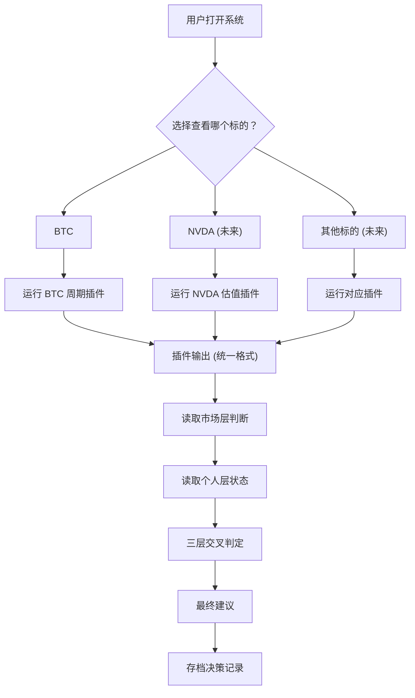

# 决策判定流程 V1

## 1. 文档目的

画清楚从"原始数据进来"到"给出最终建议"的完整判定流程。

重点是 **判定逻辑**，不是系统架构。

### 与其他文档的关系

- [00_系统总架构](./00_系统总架构.md) → 定义三层结构，本文档展开"三层如何交叉判定"
- [03_核心算法规格书](./03_核心算法规格书.md) → 公式级精度定义，本文档引用的所有计算公式见 03
- [05_BTC周期插件详细设计](./05_BTC周期插件详细设计.md) → BTC 判定的详细实现（周期阶段规则 §5、风险等级 §6、置信度 §7、决策树 §10）
- [04_数据流与状态机](./04_数据流与状态机.md) → 本文档中"数据校验"步骤的详细规则见 04 §4.3

---

## 2. 判定流程全景图



---

## 3. 第一关：数据是否充足

**在任何分析开始之前，先过数据关。**

```
原始数据到达
     │
     ▼
┌─────────────────────────────┐
│  数据校验                    │
│                             │
│  ① 数据是否存在？            │
│     → 文件/API 是否可读      │
│                             │
│  ② 数据是否新鲜？            │
│     → 最新日期距今 ≤ N 天？   │
│     → BTC: N=3 (交易日)     │
│     → NVDA: N=5 (交易日)    │
│                             │
│  ③ 数据是否完整？            │
│     → 关键时间段有无缺失      │
│     → 价格是否有异常值        │
└──────────────┬──────────────┘
               │
        ┌──────┴──────┐
        ▼             ▼
     通过           不通过
        │             │
        ▼             ▼
   继续分析      输出: insufficient_data
                 "数据不足，暂不判断"
                 (不猜，不硬算)
```

---

## 4. 第二关：机会层插件判定

### 4.1 BTC 周期插件判定流程

```
BTC 数据通过校验
     │
     ▼
┌─────────────────────────────────────────────────────────┐
│  Step 1: 周期定位 (时间 > 价格)                          │
│                                                         │
│  计算: days_since_halving = 今天 - 2024-04-20           │
│  计算: rel_day = 今天 - peak_anchor(2025-08-15)          │
│                                                         │
│  判定周期阶段:                                           │
│  ┌─────────────────────────────────────────────────┐    │
│  │ rel_day < -300  → early_accumulation (早期积累)  │    │
│  │ rel_day < -120  → mid_cycle (周期中段)           │    │
│  │ rel_day < -30   → approaching_peak (接近峰值)    │    │
│  │ rel_day < 0     → near_peak (临近峰值)           │    │
│  │ rel_day = 0     → peak (峰值)                    │    │
│  │ rel_day < 60    → early_decline (早期衰减)       │    │
│  │ rel_day >= 60   → post_peak_decline (峰后衰减)   │    │
│  └─────────────────────────────────────────────────┘    │
└──────────────────────────┬──────────────────────────────┘
                           │
                           ▼
┌─────────────────────────────────────────────────────────┐
│  Step 2: 波动退火 & 曲线匹配                              │
│                                                         │
│  对 2017 和 2021 周期:                                   │
│  ① 提取 halving→peak+60天 窗口                          │
│  ② 计算相对峰值的涨跌幅曲线                                │
│  ③ 应用退火缩放: scale = (1/VOL_LEVEL)^0.5              │
│  ④ 计算 2025 实际 vs 历史退火曲线的匹配度                  │
│                                                         │
│  匹配度指标:                                              │
│  ┌─────────────────────────────────────────────────┐    │
│  │ correlation  → 形态相似度 (越接近1越好)           │    │
│  │ RMSE         → 偏离程度 (越小越好)               │    │
│  │ pre_std      → 峰前波动率 (验证退火假设)          │    │
│  └─────────────────────────────────────────────────┘    │
└──────────────────────────┬──────────────────────────────┘
                           │
                           ▼
┌─────────────────────────────────────────────────────────┐
│  Step 3: 时间多模型融合                                   │
│                                                         │
│  模型A (中位数): halving→peak 天数中位数 = 526天          │
│       → 2025-08-22                                      │
│                                                         │
│  模型B (回归): 减半间隔 vs halving→peak 天数回归          │
│       → 趋势线外推                                       │
│                                                         │
│  模型C (峰→峰): 峰值间隔≈4年外推                         │
│       → 2025-11-10                                      │
│                                                         │
│  融合: 加权平均 (权重 1.0, 1.3, 1.1)                     │
│       → 时间窗口 [min(dates), max(dates)]               │
│       → 窗口越宽 = 不确定性越大                           │
└──────────────────────────┬──────────────────────────────┘
                           │
                           ▼
┌─────────────────────────────────────────────────────────┐
│  Step 4: BTC 插件综合判定                                 │
│                                                         │
│  输入: 周期阶段 + 匹配度 + 时间窗口                       │
│                                                         │
│  ┌───────────────────────────────────────────────┐      │
│  │                                               │      │
│  │  IF 数据不足:                                  │      │
│  │     signal = insufficient_data                │      │
│  │                                               │      │
│  │  IF 峰后衰减 + 匹配度高:                       │      │
│  │     signal = high_risk                        │      │
│  │     risk = extreme                            │      │
│  │     "历史模式确认，高风险期"                     │      │
│  │                                               │      │
│  │  IF 临近峰值 + 匹配度高:                       │      │
│  │     signal = observe                          │      │
│  │     risk = high                               │      │
│  │     "接近历史峰值区间，需谨慎"                   │      │
│  │                                               │      │
│  │  IF 周期中段 + 匹配度高:                       │      │
│  │     signal = track                            │      │
│  │     risk = medium                             │      │
│  │     "走势符合历史模式，可跟踪"                   │      │
│  │                                               │      │
│  │  IF 早期积累 + 匹配度高:                       │      │
│  │     signal = opportunity                      │      │
│  │     risk = low                                │      │
│  │     "周期早期，历史模式支持"                     │      │
│  │                                               │      │
│  │  IF 匹配度低 (任何阶段):                       │      │
│  │     confidence 下调                           │      │
│  │     "当前走势偏离历史模式，判断可靠性降低"        │      │
│  │                                               │      │
│  └───────────────────────────────────────────────┘      │
│                                                         │
│  输出: PluginOutput (统一格式)                            │
└──────────────────────────┬──────────────────────────────┘
                           │
                           ▼
                    插件判定完成
```

### 4.2 NVDA 估值插件判定流程（未来，示意）

```
NVDA 数据通过校验
     │
     ▼
┌─────────────────────────────────────────┐
│  Step 1: 内在价值估算                    │
│  DCF 折现 → 内在价值                     │
│  与当前价格比较 → 安全边际               │
└──────────────────┬──────────────────────┘
                   │
                   ▼
┌─────────────────────────────────────────┐
│  Step 2: 相对估值                        │
│  PE/PB vs 同行 → 估值位置               │
│  vs 自身历史 → 估值分位                  │
└──────────────────┬──────────────────────┘
                   │
                   ▼
┌─────────────────────────────────────────┐
│  Step 3: 质量评估                        │
│  护城河评分 + 管理层 + 现金流质量         │
└──────────────────┬──────────────────────┘
                   │
                   ▼
┌─────────────────────────────────────────┐
│  Step 4: NVDA 插件综合判定               │
│                                         │
│  安全边际 > 30% + 质量高 → opportunity  │
│  安全边际 10-30% + 质量高 → track       │
│  安全边际 < 10% → observe               │
│  估值泡沫 → high_risk                   │
│                                         │
│  输出: PluginOutput (同样格式)            │
└─────────────────────────────────────────┘
```

---

## 5. 第三关：市场层判定

**不管看什么标的，市场环境判断是共用的。**

```
┌─────────────────────────────────────────────────────────┐
│  市场层判定                                               │
│                                                         │
│  输入: BTC 周期位置 + 宏观数据 (利率/流动性等, 未来扩展)   │
│                                                         │
│  判定市场风险等级:                                        │
│                                                         │
│  ┌───────────────────────────────────────────────┐      │
│  │                                               │      │
│  │  BTC 在早期积累 + 利率下行                     │      │
│  │     → market_risk = low                       │      │
│  │     → "宏观环境友好，风险偏低"                  │      │
│  │                                               │      │
│  │  BTC 在周期中段 + 利率平稳                     │      │
│  │     → market_risk = medium                    │      │
│  │     → "环境中性，需关注变化"                    │      │
│  │                                               │      │
│  │  BTC 接近峰值 + 利率上行                       │      │
│  │     → market_risk = high                      │      │
│  │     → "环境趋紧，风险偏高"                     │      │
│  │                                               │      │
│  │  BTC 峰后衰减 + 流动性收紧                     │      │
│  │     → market_risk = extreme                   │      │
│  │     → "高风险期，不宜新增风险敞口"              │      │
│  │                                               │      │
│  └───────────────────────────────────────────────┘      │
│                                                         │
│  注: V1 阶段市场层主要用 BTC 周期作为代理指标             │
│      未来可叠加利率、VIX、流动性等宏观因子                 │
└──────────────────────────┬──────────────────────────────┘
                           │
                      market_risk
```

---

## 6. 第四关：个人层判定

**同一个机会，对不同状态的"我"，结论不同。**

```
┌─────────────────────────────────────────────────────────┐
│  个人层判定                                               │
│                                                         │
│  输入: 个人财务数据 (手工输入或定期更新)                    │
│                                                         │
│  计算:                                                   │
│  ┌───────────────────────────────────────────────┐      │
│  │                                               │      │
│  │  ① 现金流健康度                                │      │
│  │     月被动收入 / 月必要支出 = 财务自由率         │      │
│  │     > 1.5  → 健康                             │      │
│  │     1.0-1.5 → 一般                            │      │
│  │     < 1.0  → 紧张                             │      │
│  │                                               │      │
│  │  ② 可投资比例                                  │      │
│  │     可自由支配资金 / 总资产                     │      │
│  │     决定了仓位上限                              │      │
│  │                                               │      │
│  │  ③ 可承受最大回撤                              │      │
│  │     心理 + 财务双重约束                         │      │
│  │     例: 最多能接受 -30% 的回撤                  │      │
│  │                                               │      │
│  └───────────────────────────────────────────────┘      │
│                                                         │
│  输出:                                                   │
│  ┌───────────────────────────────────────────────┐      │
│  │                                               │      │
│  │  personal_capacity = strong / moderate / weak  │      │
│  │  max_position_pct = 0~100%                    │      │
│  │  max_drawdown_tolerance = 百分比               │      │
│  │                                               │      │
│  └───────────────────────────────────────────────┘      │
│                                                         │
│  注: V1 阶段可以先用简单的手工输入                        │
│      个人财务状态不频繁变化，低频更新即可                   │
└──────────────────────────┬──────────────────────────────┘
                           │
                    personal_capacity
```

---

## 7. 第五关：三层交叉判定（核心）

**这是整个系统最关键的一步。**

```
         市场层               机会层               个人层
     market_risk          plugin_output       personal_capacity
           │                    │                    │
           ▼                    ▼                    ▼
┌─────────────────────────────────────────────────────────────┐
│                                                             │
│                    三 层 交 叉 判 定                          │
│                                                             │
│  ┌─────────────────────────────────────────────────────┐    │
│  │  前置检查                                            │    │
│  │                                                     │    │
│  │  任何一层 = insufficient_data → 最终: 不判断          │    │
│  │  个人层 = weak → 最终上限: 观望 (不管其他两层多好)    │    │
│  │  市场层 = extreme → 最终上限: 观望                   │    │
│  └─────────────────────────────────────────────────────┘    │
│                           │                                 │
│                           ▼                                 │
│  ┌─────────────────────────────────────────────────────┐    │
│  │  核心判定矩阵                                        │    │
│  │                                                     │    │
│  │  market │ plugin  │ personal │ → 最终建议             │    │
│  │  ───────┼─────────┼──────────┼──────────────         │    │
│  │  low    │ opport. │ strong   │ → 长持                │    │
│  │  low    │ opport. │ moderate │ → 小仓位              │    │
│  │  low    │ track   │ strong   │ → 跟踪/小仓位         │    │
│  │  low    │ track   │ moderate │ → 跟踪                │    │
│  │  low    │ observe │ 任意     │ → 观望                │    │
│  │  medium │ opport. │ strong   │ → 小仓位              │    │
│  │  medium │ opport. │ moderate │ → 跟踪                │    │
│  │  medium │ track   │ strong   │ → 跟踪                │    │
│  │  medium │ track   │ moderate │ → 观望                │    │
│  │  high   │ opport. │ strong   │ → 跟踪 (降级)         │    │
│  │  high   │ track   │ 任意     │ → 观望                │    │
│  │  high   │ observe │ 任意     │ → 观望                │    │
│  │  extreme│ 任意    │ 任意     │ → 观望                │    │
│  │                                                     │    │
│  └─────────────────────────────────────────────────────┘    │
│                           │                                 │
│                           ▼                                 │
│  ┌─────────────────────────────────────────────────────┐    │
│  │  置信度修正                                          │    │
│  │                                                     │    │
│  │  最终 confidence = min(                              │    │
│  │      plugin.confidence,      ← 插件自身的把握        │    │
│  │      market.confidence,      ← 市场判断的把握        │    │
│  │      personal.confidence     ← 个人数据的可靠度      │    │
│  │  )                                                  │    │
│  │                                                     │    │
│  │  如果最终 confidence < 0.5:                          │    │
│  │     附加提示: "判断置信度较低，建议保守"               │    │
│  └─────────────────────────────────────────────────────┘    │
│                                                             │
└───────────────────────────┬─────────────────────────────────┘
                            │
                            ▼
                      最终建议输出
```

---

## 8. 最终输出格式

```json
{
  "generated_at": "2026-03-19T08:00:00",
  "target": "BTC",

  "decision": {
    "recommendation": "observe",
    "confidence": 0.72,
    "position_suggestion": "不建议新增仓位",
    "max_position_pct": 0
  },

  "three_layer_summary": {
    "market": {
      "risk": "high",
      "stage": "post_peak_decline",
      "summary": "BTC 周期处于峰值后衰减阶段，宏观风险偏高"
    },
    "opportunity": {
      "signal": "high_risk",
      "risk": "extreme",
      "summary": "当前走势与 2017/2021 峰后衰减高度吻合，处于高风险区间"
    },
    "personal": {
      "capacity": "moderate",
      "summary": "财务状态一般，可承受回撤有限"
    }
  },

  "reasoning": [
    "市场层: BTC 周期已过峰值，处于历史高风险区间",
    "机会层: 与历史衰减曲线匹配度 > 0.85，确认下行趋势",
    "个人层: 当前财务状态不支持承受大幅回撤",
    "综合: 三层均不支持当前入场，建议观望"
  ],

  "watch_items": [
    "关注 BTC 是否触及历史支撑区（退火曲线对应位置）",
    "关注宏观利率政策变化",
    "下次更新: 明天 08:00"
  ]
}
```

---

## 9. 判定流程一页图（打印版）

```
━━━━━━━━━━━━━━━━━━━━━━━━━━━━━━━━━━━━━━━━━━━━━━━━━━━━━━

  数据 → 校验 → 通过？
                 │
          ┌──────┴──────┐
          否            是
          │             │
     不判断          ┌──┴──┐
                     │     │
              ┌──────┴─┐ ┌─┴───────┐
              │ 机会层   │ │ 市场层   │ (并行)
              │ 插件判定 │ │ 风险判定 │
              └──────┬─┘ └─┬───────┘
                     │     │
                     ▼     ▼
                  ┌──────────┐
                  │ 个人层    │
                  │ 约束判定  │
                  └────┬─────┘
                       │
                       ▼
              ┌────────────────┐
              │  三层交叉判定    │
              │                │
              │  最差层 = 上限  │
              │  保守优先       │
              └────────┬───────┘
                       │
                       ▼
              ┌────────────────┐
              │  最终建议       │
              │  观望/跟踪/    │
              │  小仓位/长持   │
              └────────┬───────┘
                       │
                       ▼
              ┌────────────────┐
              │  存档 + 复盘    │
              └────────────────┘

━━━━━━━━━━━━━━━━━━━━━━━━━━━━━━━━━━━━━━━━━━━━━━━━━━━━━━
```

---

## 10. V1 阶段简化方案

当前只有市场层和 BTC 机会层，个人层还没开发。

**V1 的判定流程简化为：**

```
数据校验
   │
   ▼
BTC 周期插件判定
(周期定位 + 退火匹配 + 时间融合)
   │
   ▼
输出: signal + risk + confidence + reasoning
   │
   ▼
直接展示给用户 (个人层暂用默认值 moderate)
```

这意味着：
- V1 只需实现机会层的 BTC 插件
- 市场层暂时与 BTC 插件共用（BTC 周期本身就是市场信号）
- 个人层用固定默认值，不影响主流程
- **但输出格式从一开始就按三层设计**，未来加层不改接口
