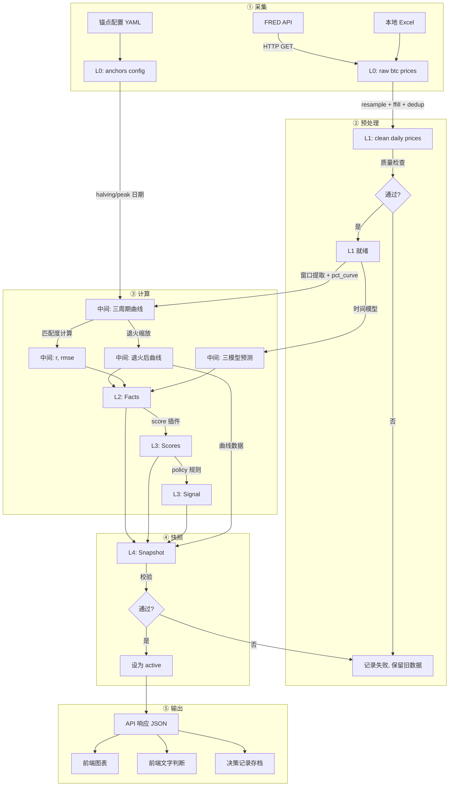

# 数据流与状态机 V1

## 1. 文档目的

把"数据从哪里来、经过什么处理、变成什么、存在哪里、谁来触发"讲清楚。

### 与其他文档的关系

- [00_系统总架构](./00_系统总架构.md) → 定义三层结构，本文档展开"数据如何在三层之间流转"
- [03_核心算法规格书](./03_核心算法规格书.md) → 定义算法公式，本文档定义"公式的输入从哪来、输出存到哪"
- [02_决策判定流程](./02_决策判定流程.md) → 定义判定逻辑，本文档定义"判定的每一步对应什么数据变换"

---

## 2. 数据生命周期总览

```
┌─────────────────────────────────────────────────────────────────────────┐
│                         数据生命周期                                     │
│                                                                         │
│  ① 采集        ② 预处理        ③ 分析计算       ④ 快照存储      ⑤ 展示   │
│                                                                         │
│  FRED API     日频对齐         退火对齐         snapshot      API/前端   │
│  本地文件     多源合并         时间融合         版本化存储    图表/文字   │
│  手工输入     校验清洗         匹配度计算       有效期管理              │
│                               信号判定                                 │
│                                                                         │
│  ─────────→  ─────────→  ─────────→  ─────────→  ─────────→            │
│  raw_data     clean_data    facts+scores  snapshot    user_output       │
│                                                                         │
└─────────────────────────────────────────────────────────────────────────┘
```

---

## 3. 数据层级定义

系统中的数据严格分为 5 个层级，每个层级有明确的读写规则：

### L0: 原始数据 (Raw Data)

```
定义: 未经任何处理的外部数据
来源: FRED API, 本地 Excel, 手工输入
存储: data/ 目录, SQLite raw_prices 表

示例:
  ┌──────────────────────────────────┐
  │ date        │ price   │ source   │
  ├──────────────────────────────────┤
  │ 2025-03-18  │ 83542.0 │ FRED     │
  │ 2025-03-17  │ 84100.0 │ FRED     │
  │ ...         │ ...     │ ...      │
  └──────────────────────────────────┘

规则:
  ✓ 只追加, 不修改已有记录
  ✓ 每条记录保留来源标记
  ✗ 不在此层做任何计算
```

### L1: 清洗数据 (Clean Data)

```
定义: 经过日频对齐、去重、填充的标准化数据
来源: 由 L0 处理得到
存储: data/btc_merged_daily.csv, SQLite clean_prices 表

处理:
  L0 → resample('D') → ffill() → dedup(priority) → sort(date)

示例:
  ┌──────────────────────────────────────────┐
  │ date        │ price   │ source │ is_fill │
  ├──────────────────────────────────────────┤
  │ 2025-03-18  │ 83542.0 │ FRED   │ false   │
  │ 2025-03-19  │ 83542.0 │ FRED   │ true    │ ← 节假日填充
  │ ...         │ ...     │ ...    │ ...     │
  └──────────────────────────────────────────┘

规则:
  ✓ 每日有且仅有一条记录
  ✓ 无缺失日期
  ✓ 保留填充标记
```

### L2: 事实层 (Facts)

```
定义: 从清洗数据计算出的确定性事实, 不含主观判断
来源: 由 L1 + 锚点配置计算
存储: SQLite facts 表, JSON 文件

内容:
  ┌───────────────────────────────────────────────────┐
  │ 事实                           │ 示例值            │
  ├───────────────────────────────────────────────────┤
  │ latest_data_date               │ 2026-03-18       │
  │ days_since_halving             │ 699              │
  │ days_from_peak_anchor          │ 216              │
  │ current_price                  │ 83542.0          │
  │ peak_anchor_price              │ 108000.0         │
  │ pct_from_anchor                │ -22.6%           │
  │ pre_std_2017                   │ 45.2             │
  │ pre_std_2021                   │ 18.7             │
  │ pre_std_2025                   │ 15.1             │
  │ scale_factor_2017              │ 0.3333           │
  │ scale_factor_2021              │ 0.5774           │
  │ halving_to_peak_days_2017      │ 528              │
  │ halving_to_peak_days_2021      │ 548              │
  │ time_scale_2017                │ 0.913            │
  │ time_scale_2021                │ 0.880            │
  │ time_fusion_window_start       │ 2025-09-01       │
  │ time_fusion_window_end         │ 2025-11-15       │
  │ time_fusion_center             │ 2025-10-05       │
  └───────────────────────────────────────────────────┘

规则:
  ✓ 所有值可由 L1 + 配置确定性计算得到
  ✓ 相同输入必须产生相同输出
  ✗ 不含"我觉得"、"可能是"
```

### L3: 评分与信号 (Scores & Signals)

```
定义: 基于 Facts 的结构化判断
来源: 由 L2 经 score 插件计算
存储: snapshot 的一部分

内容:
  ┌─────────────────────────────────────────────────────────┐
  │ Score                    │ 值     │ 标签    │ 置信度    │
  ├─────────────────────────────────────────────────────────┤
  │ cycle_stage              │ -      │ post_peak│ 0.95     │
  │ market_cycle_risk        │ 82     │ high    │ 0.84     │
  │ peak_proximity           │ 216天后 │ passed  │ 0.90     │
  │ curve_match_2017         │ r=0.91 │ strong  │ 0.91     │
  │ curve_match_2021         │ r=0.87 │ strong  │ 0.87     │
  │ data_quality             │ 95     │ good    │ 0.95     │
  └─────────────────────────────────────────────────────────┘

  最终信号:
    signal = "high_risk"
    risk_level = "extreme"
    confidence = 0.78

规则:
  ✓ 每个 score 独立计算, 不依赖其他 score
  ✓ 遵循统一输出协议 (见 01_机会层插件规范 §9)
  ✓ 信号由 policy 规则组合 score 得出
```

### L4: 快照 (Snapshot)

```
定义: 某一时刻的完整分析结果, 不可变
来源: L2 + L3 打包
存储: SQLite snapshots 表, JSON 文件

结构:
  ┌─────────────────────────────────────────────────────────┐
  │ snapshot_id: "market_2026_03_19_080000"                 │
  │ generated_at: "2026-03-19T08:00:00"                     │
  │ data_freshness: "2026-03-18"                            │
  │ policy_id: "market_policy_v1"                           │
  │ policy_version: "1.0.0"                                 │
  │ status: "active"  (active / candidate / archived)       │
  │                                                         │
  │ facts: { ... }        ← 完整 L2 数据                    │
  │ scores: [ ... ]       ← 完整 L3 数据                    │
  │ recommendation: { signal, risk, confidence }             │
  │ reasoning: [ ... ]    ← 人类可读解释                    │
  │ curves: { ... }       ← 图表所需的曲线数据               │
  └─────────────────────────────────────────────────────────┘

规则:
  ✓ 生成后不可修改 (immutable)
  ✓ 同一时刻只有一个 active snapshot
  ✓ 旧 snapshot 归档但不删除
  ✓ active 切换需经过校验
```

---

## 4. 完整数据流水线



---

## 5. 触发机制

### 5.1 什么时候触发数据更新

```
┌──────────────────────────────────────────────────────┐
│  触发方式              │ 频率       │ 触发条件          │
├──────────────────────────────────────────────────────┤
│  定时任务 (APScheduler) │ 每日 1 次  │ 每天 UTC 08:00    │
│  手动触发               │ 按需       │ 管理员调用 API    │
│  用户请求时懒加载        │ 按需       │ snapshot 过期时   │
└──────────────────────────────────────────────────────┘

过期判定:
  is_stale = (now - snapshot.generated_at) > timedelta(hours=24)
```

### 5.2 更新流程状态机

```
                    ┌─────────┐
         触发 ──────→│  IDLE   │
                    └────┬────┘
                         │ 开始
                         ▼
                    ┌─────────┐
                    │ FETCHING│ → 拉取 FRED 最新数据
                    └────┬────┘
                    成功 │    │ 失败
                         ▼    └──→ FAILED (保留旧 snapshot)
                    ┌─────────┐
                    │CLEANING │ → 预处理 + 校验
                    └────┬────┘
                    通过 │    │ 不通过
                         ▼    └──→ FAILED
                    ┌─────────┐
                    │COMPUTING│ → facts + scores + signal
                    └────┬────┘
                    成功 │    │ 异常
                         ▼    └──→ FAILED
                    ┌─────────┐
                    │SNAPSHOT │ → 生成新 snapshot
                    └────┬────┘
                    校验 │    │ 不通过
                    通过 ▼    └──→ FAILED
                    ┌─────────┐
                    │ACTIVATE │ → 切换 active
                    └────┬────┘
                         │
                         ▼
                    ┌─────────┐
                    │  DONE   │ → 回到 IDLE
                    └─────────┘
```

### 5.3 失败处理策略

```
原则: 更新失败 ≠ 系统不可用

任何阶段失败:
  1. 记录失败日志 (时间, 阶段, 错误信息)
  2. 保留当前 active snapshot 不变
  3. 用户正常请求时:
     - 返回旧 snapshot
     - 附加提示: "数据更新于 N 小时前, 最新更新失败"
  4. 下次定时任务重试
  5. 连续失败 3 次 → 发告警 (邮件/日志)
```

---

## 6. 存储设计

### 6.1 SQLite 表结构

```sql
-- L0: 原始价格
CREATE TABLE raw_prices (
    id INTEGER PRIMARY KEY,
    date TEXT NOT NULL,           -- YYYY-MM-DD
    price REAL NOT NULL,
    source TEXT NOT NULL,         -- 'FRED', 'local_2015', 'local_2021'
    fetched_at TEXT NOT NULL,     -- ISO datetime
    UNIQUE(date, source)
);

-- L1: 清洗后日频价格
CREATE TABLE clean_prices (
    date TEXT PRIMARY KEY,        -- YYYY-MM-DD
    price REAL NOT NULL,
    source TEXT NOT NULL,
    is_filled BOOLEAN DEFAULT FALSE
);

-- L4: 快照
CREATE TABLE snapshots (
    snapshot_id TEXT PRIMARY KEY,
    generated_at TEXT NOT NULL,
    data_freshness TEXT NOT NULL,  -- 数据最新日期
    policy_id TEXT NOT NULL,
    policy_version TEXT NOT NULL,
    status TEXT NOT NULL,          -- 'active', 'candidate', 'archived'
    content TEXT NOT NULL,         -- JSON blob (facts + scores + curves)
    created_at TEXT NOT NULL
);
CREATE INDEX idx_snapshots_status ON snapshots(status);

-- 更新日志
CREATE TABLE update_log (
    id INTEGER PRIMARY KEY,
    started_at TEXT NOT NULL,
    finished_at TEXT,
    status TEXT NOT NULL,          -- 'running', 'success', 'failed'
    stage TEXT,                    -- 'fetching', 'cleaning', 'computing', etc.
    error_message TEXT,
    snapshot_id TEXT               -- 成功时关联的 snapshot
);
```

### 6.2 文件存储结构

```
data/
├── raw/                          ← L0 原始文件备份
│   ├── fred_2026_03_19.csv
│   ├── fred_2026_03_18.csv
│   └── ...
├── btc_merged_daily.csv          ← L1 清洗数据
├── btc_2015.xlsx                 ← 历史数据 (不变)
├── btc_2021.xlsx                 ← 历史数据 (不变)
└── btc_price_fred.xlsx           ← 当前周期 (每日更新)

snapshots/
├── active/
│   └── market_2026_03_19_080000.json  ← 当前 active
├── archive/
│   ├── market_2026_03_18_080000.json
│   ├── market_2026_03_17_080000.json
│   └── ...
└── candidates/                    ← 能力更新时的候选版本
```

---

## 7. 配置管理

### 7.1 锚点配置 (anchors.yaml)

```yaml
# config/anchors.yaml
# 这些参数经过研究验证, 不要随意改动

cycles:
  - cycle_id: "cycle_1_2013"
    halving_date: "2012-11-28"
    peak_date: "2013-12-04"
    peak_source: "confirmed"     # confirmed / auto_detect / assumed
    vol_level: 27.0

  - cycle_id: "cycle_2_2017"
    halving_date: "2016-07-09"
    peak_date: "2017-12-19"
    peak_source: "confirmed"
    vol_level: 9.0

  - cycle_id: "cycle_3_2021"
    halving_date: "2020-05-11"
    peak_date: null              # null = auto-detect from data
    peak_source: "auto_detect"
    vol_level: 3.0

  - cycle_id: "cycle_4_2025"
    halving_date: "2024-04-20"
    peak_date: "2025-08-15"
    peak_source: "assumed"       # ← 假设值, 需持续验证
    vol_level: 1.0
```

### 7.2 算法参数配置 (parameters.yaml)

```yaml
# config/parameters.yaml

annealing:
  vol_alpha: 0.5
  scale_method: "manual"         # manual / std / hybrid
  pre_std_span: 90               # 峰前波动率计算天数

window:
  post_days: 60
  max_pre_days: 300

time_fusion:
  weights:
    base: 1.0
    regression: 1.3
    peak_to_peak: 1.1

post_peak:
  post_gamma: 0.65               # 峰后衰减系数
  post_scale_alpha: 1.0
  window_days: 400               # 扩展窗口天数

data:
  staleness_threshold_hours: 24
  max_missing_pct: 0.05
  max_daily_return: 0.50         # 单日涨跌超过50%视为异常
```

### 7.3 配置变更记录

```
每次修改配置, 必须记录:

1. 改了什么: 哪个参数, 从什么值改到什么值
2. 为什么改: 研究发现? 数据验证? bug修复?
3. 影响范围: 哪些 snapshot 需要重算?
4. 回退方案: 如果效果不好, 改回什么?

记录位置: config/CHANGELOG.md
格式:
  ## YYYY-MM-DD
  - 参数: xxx
  - 旧值: yyy
  - 新值: zzz
  - 原因: ...
  - 影响: 需重新生成 snapshot
```

---

## 8. API 请求的完整数据流

### 8.1 用户打开首页 → 获取市场判断

```
用户请求: GET /api/market/summary

服务端处理:

  ① 检查 active snapshot
     │
     ├─ 存在且未过期 → 直接返回 (最快路径, ~50ms)
     │
     ├─ 存在但过期 → 返回旧数据 + 后台触发更新
     │                (用户不等待, ~50ms + 后台 ~30s)
     │
     └─ 不存在 → 同步执行完整流水线
                  (首次使用, ~30s, 可显示加载状态)

响应:
  {
    "snapshot_id": "market_2026_03_19_080000",
    "is_stale": false,
    "data_freshness": "2026-03-18",
    "market_summary": { ... },
    "curves": { ... },
    "reasoning": [ ... ]
  }
```

### 8.2 用户查看详细图表 → 获取曲线数据

```
用户请求: GET /api/market/curves?view=scaled

服务端处理:
  ① 读取 active snapshot
  ② 从 snapshot.curves 提取:
     - dd_pct_2017_scaled  (退火后)
     - dd_pct_2021_scaled  (退火后)
     - dd_pct_2025         (原始)
     - rel_day 序列
  ③ 组装前端所需格式

响应:
  {
    "anchor_info": {
      "peak_2017": "2017-12-19",
      "peak_2021": "2021-11-10",
      "peak_2025": "2025-08-15"
    },
    "scale_factors": { "2017": 0.3333, "2021": 0.5774, "2025": 1.0 },
    "chart_data": {
      "x": [-300, -299, ..., 0, ..., 60],
      "y_2017": [-85.2, -84.9, ...],
      "y_2021": [-72.1, -71.8, ...],
      "y_2025": [-45.3, -45.0, ...]
    }
  }
```

---

## 9. 个人层数据流（阶段 4）

```
个人层数据与市场/机会层完全独立:

输入方式: 手工填写表单 (低频更新)
┌────────────────────────────────────────────────┐
│  字段                    │ 示例         │ 频率  │
├────────────────────────────────────────────────┤
│  月总收入                 │ 30,000      │ 季度  │
│  月被动收入               │ 8,000       │ 季度  │
│  月必要支出               │ 12,000      │ 季度  │
│  可自由支配投资金额        │ 100,000     │ 季度  │
│  总资产                   │ 500,000     │ 季度  │
│  心理最大可承受亏损比例     │ 30%         │ 年度  │
│  已有仓位 (可选)          │ BTC: 10%    │ 月度  │
└────────────────────────────────────────────────┘

计算:
  financial_freedom_ratio = 月被动收入 / 月必要支出
  investable_ratio = 可自由支配投资金额 / 总资产
  max_drawdown_tolerance = 心理最大可承受亏损比例

  capacity:
    IF financial_freedom_ratio > 1.5 AND investable_ratio > 0.3:
      → strong
    ELIF financial_freedom_ratio > 1.0 AND investable_ratio > 0.15:
      → moderate
    ELSE:
      → weak

存储:
  SQLite personal_profile 表 (带版本号, 每次修改新增一行)
  加密存储 (本地, 不上传服务器)
```

---

## 10. 数据流与文档交叉验证

下表确保各文档之间的概念一致性：

| 数据层级 | 本文档 | 03_算法规格书 | 00_总架构 | 02_判定流程 |
|----------|--------|-------------|-----------|------------|
| L0 原始数据 | §3 L0 | §4 模块A | 数据源 | 第一关:数据校验 |
| L1 清洗数据 | §3 L1 | §4.2 预处理 | — | — |
| L2 事实层 | §3 L2 | §5-7 计算公式 | 统一输出的 context | 第二关:插件判定 |
| L3 评分信号 | §3 L3 | §5.7 匹配度 | 统一输出的 assessment | 第三四五关 |
| L4 快照 | §3 L4 | — | — | 最终输出格式 |
| 锚点配置 | §7.1 | §3 全局常量表 | — | — |
| 算法参数 | §7.2 | §3 全局常量表 | — | — |
| 个人层数据 | §9 | — | 个人层定义 | 第四关:个人层 |
