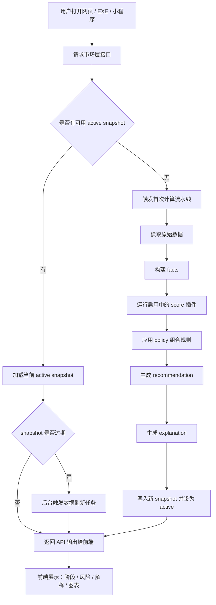
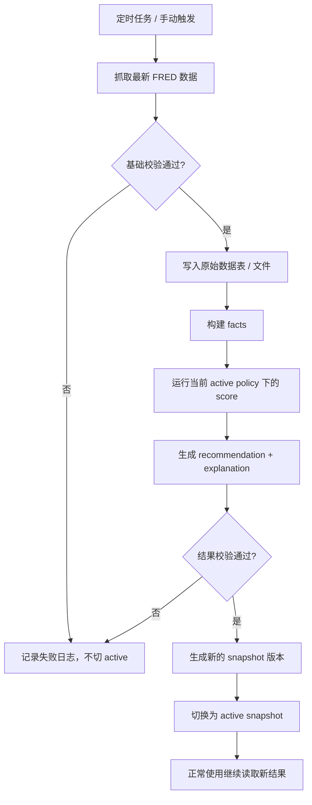
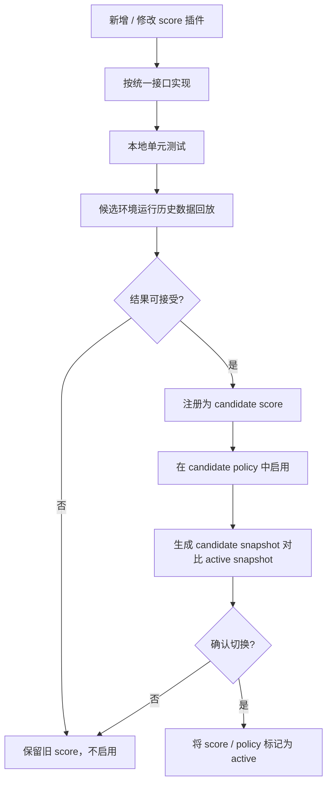

# 市场层决策引擎：流程、更新机制与 IO 定义 V1

## 1. 文档目标

这份文档只解决一件事：

把当前仓库未来要实现的 **市场层决策引擎** 讲清楚。

重点不是愿景，而是以下 5 件事：

1. 主流程到底是什么。
2. 系统结构如何保持精简。
3. 哪些部分允许插拔和替换。
4. 更新需求如何完成，谁更新，怎么更新，更新后怎么继续正常使用。
5. 输入和输出到底怎么定义。

---

## 2. 设计原则

### 2.1 主流程稳定，局部能力可插拔

系统的主流程不应该频繁改变。

真正允许变化的，应当主要是：

- 某个 `score` 的新增
- 某个 `score` 的下架
- 某个策略配置的调整

### 2.2 默认低维护，不依赖频繁调参

这个系统不应建立在“持续训练、持续调规则、持续盯指标”的基础上。

默认策略应该是：

- 数据自动更新
- 规则低频更新
- score 低频扩展
- 用户日常使用时不感知内部维护

### 2.3 不做黑盒大脑

最终决策不是让 AI 直接拍板。

更合理的结构是：

- 数据与事实层：确定性
- score 层：结构化
- policy 层：显式配置
- explanation 层：AI 可选参与，但不掌控主判断

### 2.4 更新要可追踪、可回退、可共存

每次变更都应当能回答：

- 现在用的是哪个版本？
- 上一个版本是什么？
- 如果新版本有问题，怎么回退？
- 老版本结果还能不能复现？

---

## 3. 精简结构

建议将市场层决策引擎压缩为 6 层。


### 3.1 Raw Data 原始数据

职责：

- 存放未经解释的原始输入
- 例如 FRED BTC 日线、手工锚点配置、历史周期表

特点：

- 只负责真实记录
- 不掺杂结论

### 3.2 Facts 事实层

职责：

- 将原始数据整理为可复用事实

例如：

- 当前数据最新日期
- 当前周期相对 halving 的天数
- 当前相对锚点涨跌幅
- 当前是否已超过某历史阶段阈值
- 2025 周期相对历史周期的对齐结果

特点：

- 这是决策引擎的稳定中间层
- score 不直接读原始 Excel/CSV，而是读 facts

### 3.3 Score Plugins 分数插件层

职责：

- 每个插件只负责一个明确定义的判断维度

例如：

- `market_cycle_risk`
- `peak_proximity_score`
- `drawdown_risk`
- `trend_stability_score`
- `data_quality_score`

特点：

- 插拔式
- 单一职责
- 输出统一协议

### 3.4 Policy 策略组合层

职责：

- 决定启用哪些 score
- 哪些是 required，哪些是 optional
- 权重、阈值和缺失处理策略是什么

特点：

- 不写死在主业务流程中
- 用配置驱动

### 3.5 Recommendation 建议状态

职责：

- 不输出“万能总分”
- 输出面向用户的建议状态

建议状态可以先固定为：

- `insufficient_data`
- `high_risk_observe`
- `observe`
- `small_position_only`
- `structured_hold`

### 3.6 Explanation 输出解释层

职责：

- 把 facts、scores、policy 结果组织成可读结论

这里允许：

- 规则模板解释
- AI 生成式解释

但要求：

- AI 只能解释，不直接修改 score 和 policy 结果

---

## 4. 完整主流程图



这个流程强调两件事：

1. 用户正常使用时，应优先读取 **active snapshot**，而不是每次现算。
2. 数据更新可以后台完成，不能因为刷新任务而阻塞日常使用。

---

## 5. 正常使用是怎么完成的

用户日常使用时，系统应尽量像“读一个稳定结果”而不是“每次重跑研究脚本”。

### 5.1 正常使用步骤

1. 用户打开产品。
2. 前端请求市场层决策接口。
3. 后端读取当前 `active snapshot`。
4. 如果 snapshot 仍在有效期内，直接返回。
5. 如果 snapshot 过期，则后台触发刷新，同时仍优先返回最近一次可用结果。
6. 用户看到的是：
   - 当前市场判断
   - 周期阶段
   - 风险档位
   - 关键 score
   - 图表与解释

### 5.2 正常使用时的关键要求

- 用户不需要手工跑脚本
- 用户不需要等待复杂计算完成
- 用户始终能拿到一份“最近可用且版本明确”的结果

---

## 6. 更新需求分为哪几类

这里必须严格区分两类“更新”。

### 6.1 数据更新

这是日常更新，应该自动完成。

例如：

- 拉取最新 BTC 日线
- 重新生成 facts
- 重算 score
- 生成新的 snapshot

这类更新：

- 高频
- 自动
- 不改变主流程

### 6.2 能力更新

这是结构更新，应低频手工完成。

例如：

- 新增一个 score
- 下架一个 score
- 修改 policy 权重
- 更改锚点规则
- 调整 explanation 模板

这类更新：

- 低频
- 显式版本化
- 需要验证后再启用

---

## 7. 数据更新如何完成

数据更新应该是最稳定、最自动的一类更新。

### 7.1 数据更新流程图



### 7.2 数据更新最关键的机制

#### 不覆盖旧结果

新结果生成前，旧的 active snapshot 继续可用。

#### 校验通过后才切 active

不能“先覆盖，再检查”。

#### 失败时自动保留旧版本

更新失败不应让系统变成不可用。

### 7.3 数据更新后用户如何正常使用

用户不需要做任何额外操作。

系统在下一次请求时会自动返回最新 active snapshot。

---

## 8. score / policy 更新如何完成

这是你最关心的“低维护但可插拔”部分。

### 8.1 基本原则

- 新增 score 不改主流程
- 下架 score 不改主流程
- 组合规则主要通过 policy 配置控制
- 新旧 policy 可以并存

### 8.2 score 生命周期

每个 score 建议有以下状态：

- `draft`
- `candidate`
- `active`
- `deprecated`
- `disabled`

### 8.3 score 更新流程图



### 8.4 下架 score 如何完成

下架不应删除旧代码或旧字段，而应：

1. 在 policy 中去掉该 score。
2. 将其状态标记为 `deprecated` 或 `disabled`。
3. 保留旧版本结果可复现。

这样做的好处是：

- 老结果还能回看
- 新流程不再依赖它
- 主流程不受影响

---

## 9. 插拔接口怎么定义

为了实现低维护插拔，每个 score 都应遵守统一输出协议。

## 9.1 score 输入

每个 score 只接收：

- `facts`
- `score_config`
- `context`

不直接读数据库或原始 Excel。

## 9.2 score 输出协议

建议统一为：

```json
{
  "score_id": "market_cycle_risk",
  "score_version": "1.0.0",
  "category": "market",
  "status": "ok",
  "numeric_value": 82,
  "label": "high",
  "confidence": 0.84,
  "reason": "当前周期已进入历史高风险区间附近",
  "facts_used": [
    "days_since_halving",
    "pct_from_anchor",
    "cycle_alignment_band"
  ]
}
```

### 9.3 status 约定

统一约定以下状态：

- `ok`
- `missing`
- `error`
- `disabled`

### 9.4 required / optional 机制

policy 中应将 score 分成两类：

#### required

没有它就不能给出正常 recommendation。

#### optional

缺失时可以继续运行，但要降低解释完整度或置信度。

---

## 10. policy 怎么定义

policy 是整个可插拔系统的核心。

建议它只做 4 类事：

1. 声明启用哪些 score
2. 定义 required / optional
3. 定义权重和阈值
4. 定义缺失和异常处理策略

### 10.1 示例 policy

```yaml
policy_id: market_policy_v1
policy_version: 1.0.0

required_scores:
  - market_cycle_risk
  - data_quality_score

optional_scores:
  - peak_proximity_score
  - drawdown_risk
  - trend_stability_score

weights:
  market_cycle_risk: 0.40
  peak_proximity_score: 0.25
  drawdown_risk: 0.15
  trend_stability_score: 0.10
  data_quality_score: 0.10

missing_score_strategy: renormalize

states:
  insufficient_data:
    when:
      - required_missing
      - data_quality_below: 0.5
  high_risk_observe:
    when:
      - weighted_score_gte: 80
  observe:
    when:
      - weighted_score_gte: 60
  small_position_only:
    when:
      - weighted_score_gte: 40
  structured_hold:
    when:
      - weighted_score_lt: 40
```

### 10.2 为什么 policy 要配置化

因为未来新增或下架 score 时，主要应该改的是 policy，而不是主流程。

---

## 11. Input 定义

需要分 3 层定义 input。

## 11.1 用户输入

对于市场层 V1，用户输入应尽量少。

建议只保留：

- `mode=latest`
- `target_date`，可选
- `view=summary|detail`

当前阶段不建议引入太多交互参数。

## 11.2 系统输入

这是决策引擎真正依赖的输入：

- BTC 原始价格数据
- halving / peak 锚点配置
- 当前 active policy
- 当前启用的 score 列表
- 可选的人工修正规则

## 11.3 插件输入

score 插件只吃：

- facts
- score_config
- context

其中 context 可以包含：

- `snapshot_id`
- `policy_version`
- `generated_at`

---

## 12. Output 定义

输出同样分成 3 层。

## 12.1 中间输出：facts

这层主要给系统内部和 debug 使用。

示例：

```json
{
  "snapshot_id": "market_2026_03_18_080000",
  "latest_data_date": "2026-03-01",
  "halving_date": "2024-04-20",
  "peak_anchor_date": "2025-08-15",
  "days_since_halving": 681,
  "days_from_anchor": 198,
  "pct_from_anchor": -43.4,
  "current_cycle_stage": "post_peak_decline"
}
```

## 12.2 结构化输出：scores + recommendation

示例：

```json
{
  "snapshot_id": "market_2026_03_18_080000",
  "policy_id": "market_policy_v1",
  "policy_version": "1.0.0",
  "recommendation": {
    "state": "high_risk_observe",
    "confidence": 0.78
  },
  "scores": [
    {
      "score_id": "market_cycle_risk",
      "numeric_value": 82,
      "label": "high",
      "status": "ok"
    },
    {
      "score_id": "data_quality_score",
      "numeric_value": 95,
      "label": "good",
      "status": "ok"
    }
  ]
}
```

## 12.3 面向用户输出：summary + chart + reasons

示例：

```json
{
  "generated_at": "2026-03-18T08:00:00",
  "data_freshness": {
    "latest_data_date": "2026-03-01",
    "is_stale": false
  },
  "market_summary": {
    "stage": "post_peak_decline",
    "risk_label": "high",
    "recommendation_state": "high_risk_observe"
  },
  "reasons": [
    "当前价格已明显低于阶段锚点",
    "当前周期位置位于历史高风险后段",
    "核心数据完整，可正常输出判断"
  ],
  "watch_items": [
    "后续回撤是否接近历史主要支撑区",
    "锚点规则是否需要切换到统一版本"
  ],
  "charts": {
    "halving_to_peak_scaled": "...",
    "halving_to_peak_unscaled": "..."
  }
}
```

---

## 13. 建议的目录结构

为了后续实现清晰，建议未来在本仓库中采用如下结构：

```text
app/
├── main.py
├── routers/
│   └── market.py
├── domain/
│   ├── schemas.py
│   ├── facts.py
│   └── recommendation.py
├── services/
│   ├── pipeline.py
│   ├── snapshot_manager.py
│   └── updater.py
├── scores/
│   ├── base.py
│   ├── market_cycle_risk.py
│   ├── peak_proximity_score.py
│   ├── drawdown_risk.py
│   └── data_quality_score.py
├── policies/
│   └── market_policy_v1.yaml
└── config/
    ├── anchors.yaml
    └── runtime.yaml
```

这个结构的重点是：

- `scores/` 负责插件
- `policies/` 负责组合
- `services/pipeline.py` 负责固定主流程
- `snapshot_manager.py` 负责 active/candidate 切换

---

## 14. 最低维护版本应该怎么落地

为了控制维护成本，V1 建议只启用极少数稳定 score。

建议先做 4 个：

1. `market_cycle_risk`
2. `peak_proximity_score`
3. `drawdown_risk`
4. `data_quality_score`

并明确：

- 先不做自动学习
- 先不做在线调权重
- 先不做复杂 AI 自动改规则
- 先不做几十个 score 的体系

V1 的重点是把：

- 主流程
- 插件接口
- policy 配置
- snapshot 切换
- API 输出

这 5 件事先做稳。

---

## 15. 最终结论

最适合当前项目的不是“一个不断自我进化的复杂系统”，而是：

**一个主流程稳定、score 可插拔、policy 可配置、更新可版本化、使用可无感的市场层决策引擎。**

这套设计有三个核心好处：

1. 日常使用稳定，不依赖频繁维护。
2. 未来新增或下架 score 时，不需要推倒主流程。
3. 可以自然扩展到 EXE、网页和小程序，而不改变底层决策链。
