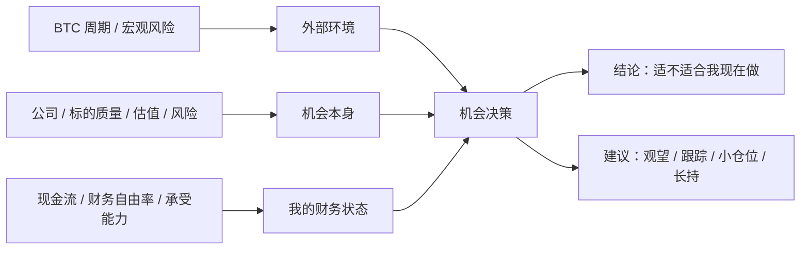
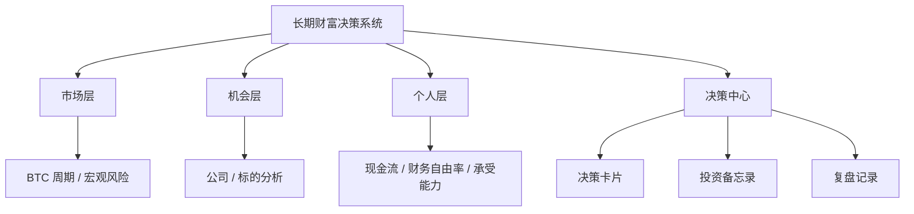

# 长期财富决策系统：产品定位与需求 V1

## 1. 文档目的

这份文档用于重新定义本项目的总需求、产品定位和阶段路线。

目标不是把多个金融工具硬塞进一个大 App，而是先明确：

1. 我们到底在解决什么总问题。
2. 这三个金融方向之间是什么关系。
3. 为什么当前应当先用 `BTC_analysis_tool` 这个仓库落地第一阶段。
4. 后续如何自然扩展到桌面版、EXE 或微信小程序。

---

## 2. 一句话定位

这是一个面向普通长期投资者的 **长期财富决策系统**。

它的目标不是提供更多金融数据，而是帮助用户根据：

- 外部市场环境
- 机会本身质量
- 个人现金流与财务自由状态

做出 **适合自己阶段的长期财富决策**。

### 2.1 对外表述建议

为了便于后续统一品牌和不同终端形态，建议暂时采用两层命名：

- 母产品名：`长期财富决策系统`
- 当前仓库产品名：`BTC 周期决策引擎`

对外解释时可以这样说：

> 长期财富决策系统的第一阶段产品，是一个用 BTC 周期来判断市场环境的决策引擎。

---

## 3. 我们到底在解决什么问题

普通人做投资决策时，真正困难的不是“拿不到数据”，而是：

1. 不知道现在的大环境是否适合承担风险。
2. 不知道一个机会本身到底好不好。
3. 不知道这个机会是否适合现在的自己。
4. 很容易被终端、指标、资产净值和短期波动带偏。

所以本产品的核心需求不是“信息展示”，而是“决策支持”。

更准确地说，本产品要回答的是：

**这个机会，在现在这个市场里，对现在的我，值不值得做。**

---

## 4. 三个项目的统一关系

此前的三个金融项目并不是三条互不相干的线，而是同一个决策链的三个层次。

### 4.1 市场层

对应当前的 `BTC_analysis_tool`。

它解决的是：

- 现在市场大概处于什么周期位置。
- 风险偏高还是偏低。
- 当前更接近“进攻期、过热期、回撤期”中的哪一种。

### 4.2 机会层

对应此前的“巴菲特/芒格式个股分析”方向。

它解决的是：

- 一个具体机会是否值得长期持有。
- 它的生意、护城河、管理层、现金流质量、估值和风险是否成立。

### 4.3 个人层

对应“富爸爸财务自由 App”方向。

它不是一个孤立模块，而是整个系统的 **个人约束层**。

它解决的是：

- 你的现金流是否稳。
- 你的必要支出压力是否高。
- 你的被动收入是否足够。
- 你有没有能力承受某类投资的波动和回撤。

也就是说，个人财务状态不是“决策之后再看”，而是“决策之前就应该参与判断”。

---

## 5. 产品原则

### 5.1 不是金融终端，而是财富决策工具

不追求海量数据、专业终端、复杂图表堆叠。

追求的是：

- 低压力
- 可解释
- 能落到行动

### 5.2 决策优先于数据展示

用户最终要得到的不是“更多信息”，而是：

- 当前环境判断
- 机会质量判断
- 与自身状态的匹配判断
- 一个清晰的下一步建议

### 5.3 时间与阶段感比短期波动更重要

尤其在市场层，本系统会优先强调：

- 周期位置
- 风险温度
- 演进趋势

而不是短期涨跌刺激。

### 5.4 个人约束是真实决策的一部分

同一个机会，对不同人可以有不同结论。

因为真正重要的不是“它是不是好机会”，而是：

**它是不是适合现在的你。**

### 5.5 先单点做深，再横向扩展

当前不做“大而全”。

先在这个仓库里把市场层做成一个真正可用的产品原型，再向机会层和个人层扩展。

---

## 6. 产品边界

### 6.1 现在要做的

当前仓库承接的是 **第一阶段产品**，即：

**长期财富决策系统的市场层入口产品。**

用 BTC 周期分析作为第一个可运行、可验证、可展示的版本。

这个版本要能完成：

1. 自动拉取最新 BTC 数据。
2. 按统一口径运行现有 Python 核心算法。
3. 输出可读的周期判断、图表和解释。
4. 为未来的统一产品提供第一套 API、数据流和展示方式。

### 6.2 现在不做的

当前阶段明确不做以下内容：

- 不做交易执行。
- 不做实时专业行情终端。
- 不做投资组合净值中心。
- 不做把三个模块强行塞进同一个首页的大杂烩界面。
- 不做拟人化 agent 作为产品主轴。

---

## 7. 为什么以 BTC_analysis_tool 为起点

原因很明确：

1. 现有仓库已经有可运行的核心算法和大量研究产出。
2. 它已经具备“数据输入 -> 分析 -> 图表输出”的基本链路。
3. 它最适合先被产品化为一个稳定的市场判断引擎。
4. 一旦市场层跑通，后续机会层和个人层都可以复用同样的产品方法：
   - 统一 API 思维
   - 统一解释型输出
   - 统一前端展示与多端扩展

所以本仓库的角色不是“永远只做 BTC”。

它的更准确角色是：

**长期财富决策系统的第一块产品基石。**

---

## 8. 当前仓库的正式定位

基于以上重构，当前仓库的正式定位定义为：

**BTC 周期决策引擎 / 市场环境模块 V1**

它服务于总产品中的“外部环境判断”部分，核心功能应围绕以下问题展开：

1. 当前 BTC 周期位于哪个阶段。
2. 当前周期与 2017、2021 等历史周期相比相似度如何。
3. 当前是否接近阶段性顶部、过热区或回撤区。
4. 在给定时间点下，大致对应什么价格区间与风险状态。

这个模块的输出应当尽量偏向“判断语言”，而不只是“研究图表语言”。

---

## 9. 当前版本用户价值

对用户而言，第一阶段产品不只是一个 BTC 图表工具，而是一个帮助理解市场位置的工具。

用户打开它，理想上应当快速得到：

- 今天的市场判断
- 当前周期阶段
- 与历史周期的对照
- 风险提示
- 下一步建议

例如：

- 当前处于本轮周期后段，但是否已完成顶部确认仍需结合统一锚点规则。
- 若处于高风险区，应以控制仓位和观察确认信号为主。
- 若处于中段或回撤后阶段，则关注后续时间窗口与结构演进。

---

## 10. 产品结构建议

长期来看，产品结构建议为：

这里最值得强调的是：

### 10.1 三层判断可以放在同一个产品里

因为它们共同服务于“财富决策”。

### 10.2 但不应该做成同一个大页面

每一层都应是独立模块。

### 10.3 真正把它们连起来的是“决策中心”

未来统一产品最重要的公共层，不是总首页，而是：

- 某个机会的决策记录
- 某次判断的依据
- 某个时间点的结论与事后复盘

---

## 11. 分阶段路线

### 阶段 1：市场层产品化（当前仓库）

目标：

- 把现有 Python 脚本整理为稳定的分析服务。
- 提供统一 API。
- 明确锚点、参数、输出口径。
- 做出可长期演进的网页端或桌面端原型。

阶段 1 的关键产物：

- `FastAPI` 后端
- 数据更新调度
- 统一的 BTC 周期分析接口
- 面向用户的解释型输出
- 可扩展到 EXE / 小程序的前端壳

### 阶段 2：决策中心

目标：

- 把“市场判断”从一张图，升级为一条可保存的决策记录。

关键产物：

- 决策卡片
- 判断摘要
- 风险标签
- 时间戳与复盘机制

### 阶段 3：机会层

目标：

- 引入个股/标的分析模块。

关键产物：

- 标的研究报告
- 质量、估值、风险三段式结论
- 与市场层联动的机会判断

### 阶段 4：个人层

目标：

- 引入现金流和财务自由约束。

关键产物：

- 被动收入
- 必要支出
- 财务自由率
- 基于个人状态修正的决策建议

### 阶段 5：多端形态

统一母产品成熟后，再考虑不同载体：

- 网页版
- 桌面 EXE
- 微信小程序

原则是：

**先把核心决策链跑通，再决定壳。**

---

## 12. 当前仓库的需求重写结果

基于本次梳理，当前仓库不再只是“BTC 价格预测小程序”。

更准确的表述应为：

### 当前仓库目标

将现有 BTC 周期研究工程化为一个可持续更新、可通过 API 提供能力、可扩展到网页/桌面/小程序的 **市场环境判断模块**。

### 当前仓库核心需求

1. 核心算法与现有 Python 脚本结果一致。
2. 每日自动更新 BTC 数据。
3. 统一输出周期位置、锚点、时间窗口、价格区间和解释。
4. 对外以 API 提供 JSON 能力。
5. 前端展示以“判断与决策支持”为目标，而不是单纯绘图。

### 当前仓库成功标准

1. 同一输入数据下，工程化结果与现有脚本数值一致。
2. 用户打开后无需手工更新数据即可得到最新判断。
3. 输出不仅有图，还有可读结论。
4. 后续可以自然接入 EXE 或小程序，而不需要推倒重来。

---

## 13. 最终结论

这三个金融方向可以被统一，但统一的方式不是“把所有功能装进一个 App”。

正确的统一方式是：

**以“长期财富决策系统”为母产品，先用 BTC_analysis_tool 做市场层入口版本，再逐步向机会层和个人层扩展。**

因此，当前最正确的执行动作不是同时开发三个产品，而是：

**把这个仓库打造成第一阶段可用的产品底座。**
